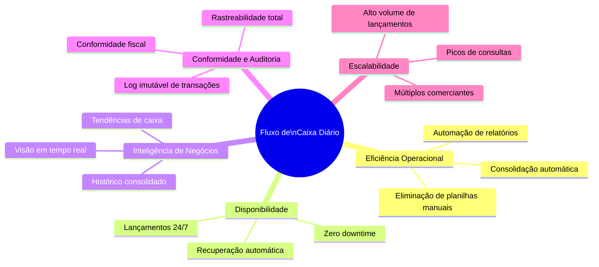
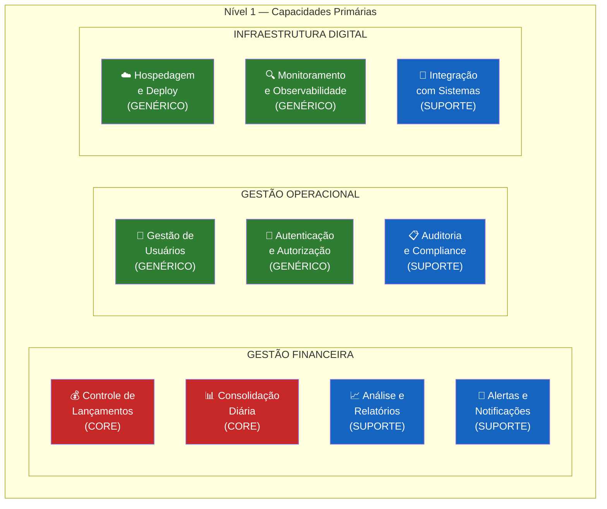
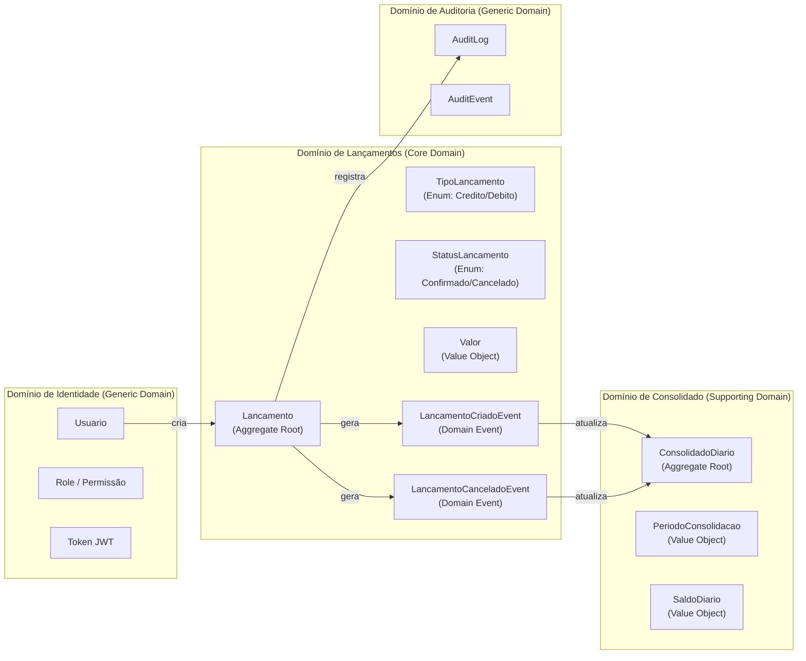
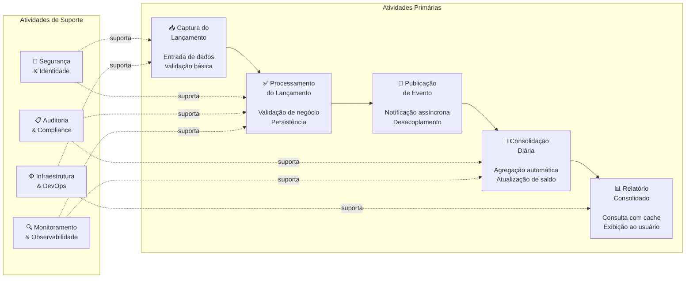
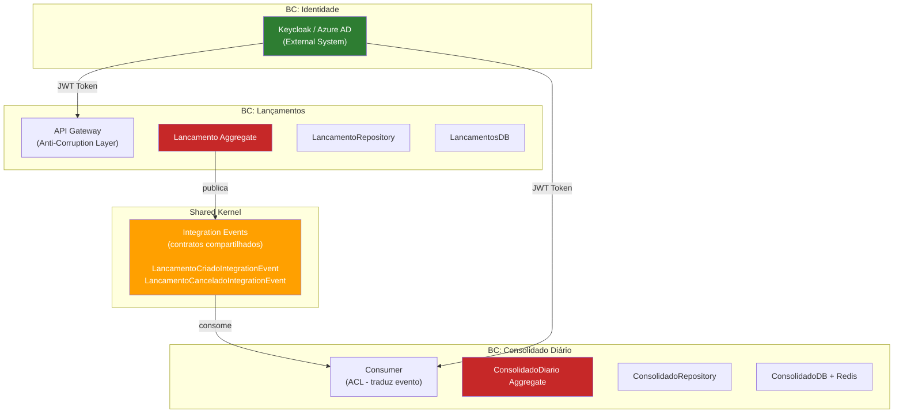
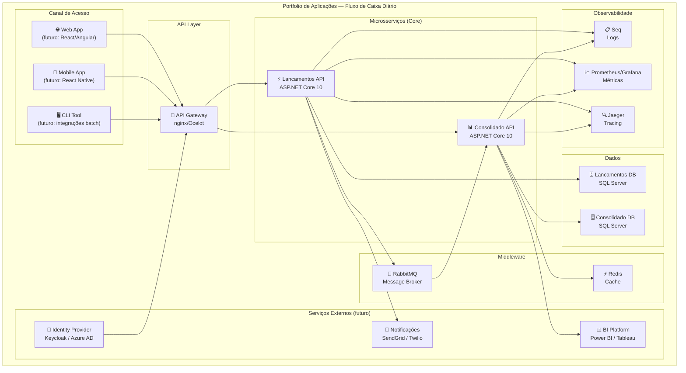
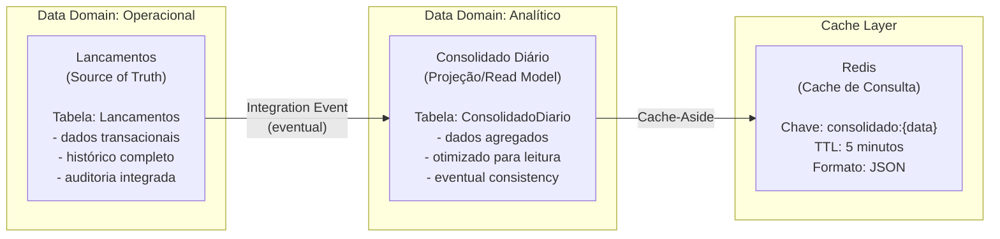
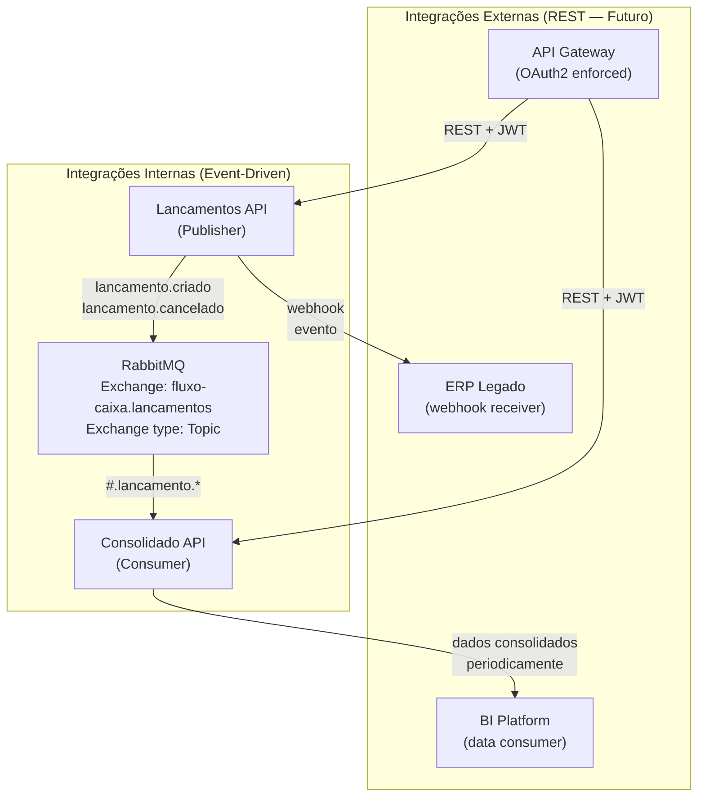
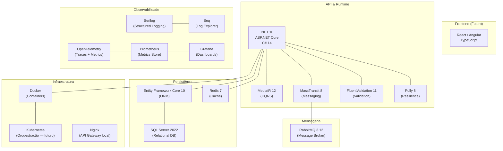

# Arquitetura Enterprise — Fluxo de Caixa Diário

> **Framework:** TOGAF-Aligned (ADM Phase B — Business Architecture / Phase C — Information Systems)
> **Versão:** 1.1.0 | **Data:** Junho 2026
> **Audience:** CTO, Diretores, Enterprise Architecture Board, Gestores de TI

---

## Sumário

1. [Visão Estratégica de Negócios](#1-visão-estratégica-de-negócios)
2. [Drivers Estratégicos](#2-drivers-estratégicos)
3. [Mapa de Capacidades de Negócio](#3-mapa-de-capacidades-de-negócio)
4. [Mapa de Domínios Funcionais](#4-mapa-de-domínios-funcionais)
5. [Cadeia de Valor](#5-cadeia-de-valor)
6. [Bounded Contexts (DDD)](#6-bounded-contexts-ddd)
7. [Mapa de Aplicações](#7-mapa-de-aplicações)
8. [Arquitetura de Dados Corporativa](#8-arquitetura-de-dados-corporativa)
9. [Arquitetura de Integração Corporativa](#9-arquitetura-de-integração-corporativa)
10. [Arquitetura Tecnológica de Referência](#10-arquitetura-tecnológica-de-referência)
11. [Segurança e Conformidade](#11-segurança-e-conformidade)
12. [Modelo de Governança](#12-modelo-de-governança)
13. [Análise de Gaps (AS-IS vs TO-BE)](#13-análise-de-gaps-as-is-vs-to-be)

---

## 1. Visão Estratégica de Negócios

### 1.1 Contexto Organizacional

O comerciante opera um negócio de varejo/serviços que necessita de **controle financeiro rigoroso e em tempo real**. A ausência de uma solução digital integrada resulta em:

- **Perda de visibilidade** sobre o fluxo de caixa intradiário
- **Decisões financeiras tardias** baseadas em dados do dia anterior
- **Risco operacional** por falta de alertas de saldo negativo
- **Esforço manual** em consolidação de dados e geração de relatórios

### 1.2 Visão de Futuro (TO-BE)

> *"Um comerciante com controle financeiro digital, em tempo real, que toma decisões baseadas em dados atualizados, com total rastreabilidade e disponibilidade contínua."*

---

## 2. Drivers Estratégicos



| Driver | Impacto no Negócio | Prioridade |
|--------|-------------------|-----------|
| Controle financeiro em tempo real | Redução de risco de inadimplência | 🔴 Alta |
| Disponibilidade 99.9% | Operação contínua sem interrupções | 🔴 Alta |
| Consolidação automática | Redução de 80% do trabalho manual | 🟡 Média |
| Auditabilidade | Conformidade regulatória | 🟡 Média |
| Escalabilidade multi-comerciante | Crescimento da base de clientes | 🟢 Futura |

---

## 3. Mapa de Capacidades de Negócio

> O Mapa de Capacidades de Negócio (Business Capability Map) representa **o que** a organização faz, independentemente de como é feito. É a base para o alinhamento entre Negócio e TI.



**Legenda:**
- 🔴 **CORE** — Diferencial competitivo, construir internamente
- 🔵 **SUPORTE** — Importante mas não diferencial, construir ou comprar
- 🟢 **GENÉRICO** — Commodity, usar serviços gerenciados ou off-the-shelf

### 3.1 Decomposição das Capacidades Core

#### Capacidade C1 — Controle de Lançamentos

| Sub-capacidade | Descrição | Nível de Maturidade |
|----------------|-----------|---------------------|
| Registro de Créditos | Registrar entradas financeiras | 🟢 Implementado |
| Registro de Débitos | Registrar saídas financeiras | 🟢 Implementado |
| Cancelamento de Lançamentos | Anular lançamentos registrados | 🟢 Implementado |
| Categorização | Classificar por tipo/categoria | 🔴 Planejado (v2) |
| Lançamentos Recorrentes | Lançamentos automáticos periódicos | 🔴 Planejado (v3) |

#### Capacidade C2 — Consolidação Diária

| Sub-capacidade | Descrição | Nível de Maturidade |
|----------------|-----------|---------------------|
| Agregação por Data | Somar créditos e débitos do dia | 🟢 Implementado |
| Cálculo de Saldo | Saldo líquido diário | 🟢 Implementado |
| Histórico Consolidado | Consulta por período | 🟢 Implementado |
| Consolidação em Tempo Real | Atualização imediata após lançamento | 🟡 Eventual (< 5s) |
| Fechamento Contábil | Bloquear edição de dias fechados | 🔴 Planejado (v2) |

---

## 4. Mapa de Domínios Funcionais



### 4.1 Classificação dos Domínios (DDD Strategic Design)

| Domínio | Tipo DDD | Complexidade | Justificativa |
|---------|----------|-------------|---------------|
| **Lançamentos** | Core Domain | Alta | Diferencial de negócio, regras específicas |
| **Consolidado Diário** | Supporting Domain | Média | Suporta o Core, modelo mais simples |
| **Identidade/Auth** | Generic Domain | Baixa | Commodity (usar Keycloak/Azure AD) |
| **Auditoria** | Generic Domain | Baixa | Cross-cutting concern |

---

## 5. Cadeia de Valor



**Entrega de Valor ao Comerciante:**

```
Registro Rápido    →    Processamento Confiável    →    Relatório Preciso
(< 500ms)               (durabilidade garantida)         (< 200ms)
```

---

## 6. Bounded Contexts (DDD)



### 6.1 Mapa de Contextos (Context Map)

| Contexto | Tipo de Relacionamento | Com | Mecanismo |
|----------|----------------------|-----|-----------|
| Lançamentos → Consolidado | **Customer/Supplier** (Upstream/Downstream) | Consolidado consome do Lançamentos | Integration Events via RabbitMQ |
| Lançamentos → Identidade | **Conformist** | Lançamentos respeita contratos do IdP | JWT Token |
| Consolidado → Identidade | **Conformist** | Consolidado respeita contratos do IdP | JWT Token |
| Lançamentos/Consolidado → **Shared Kernel** | **Shared Kernel** | Contratos de eventos compartilhados | NuGet Package |

---

## 7. Mapa de Aplicações



### 7.1 Matriz de Aplicações por Capacidade

| Capacidade | Aplicação Suporte | Ciclo de Vida | Criticidade |
|------------|------------------|---------------|-------------|
| Registro de Lançamentos | Lancamentos API | Ativo | 🔴 Crítico |
| Consulta de Saldo | Consolidado API | Ativo | 🔴 Crítico |
| Autenticação | IdP (futuro) | Planejado | 🔴 Crítico |
| Relatórios Avançados | BI Platform (futuro) | Planejado | 🟡 Importante |
| Notificações | Notificações (futuro) | Planejado | 🟡 Importante |
| Monitoramento | Prometheus/Grafana | Ativo | 🟡 Importante |
| Auditoria de Logs | Seq | Ativo | 🟡 Importante |

---

## 8. Arquitetura de Dados Corporativa

### 8.1 Domínios de Dados



### 8.2 Políticas de Retenção de Dados

| Dado | Retenção | Justificativa | Storage |
|------|----------|--------------|---------|
| Lançamentos | 10 anos | Conformidade fiscal/contábil | SQL Server (particionamento por ano) |
| Consolidado Diário | 10 anos | Histórico de negócios | SQL Server |
| Audit Logs | 5 anos | Rastreabilidade regulatória | SQL Server / Cold Storage |
| Logs de Aplicação | 90 dias | Diagnóstico operacional | Seq / Azure Monitor |
| Cache Redis | 5 minutos | Dados recentes e frequentes | Redis (TTL) |

### 8.3 Qualidade e Integridade dos Dados

| Regra | Implementação | Camada |
|-------|--------------|--------|
| Valor deve ser positivo | ValueObject `Valor` | Domínio |
| Data não pode ser futura | FluentValidation | Aplicação |
| Lançamento cancelado não pode ser re-ativado | State machine no Aggregate | Domínio |
| Consolidado é idempotente por lançamento | Chave de idempotência | Infraestrutura |
| Campos de auditoria obrigatórios | Interceptor EF Core | Infraestrutura |

---

## 9. Arquitetura de Integração Corporativa

### 9.1 Topologia de Integração



### 9.2 Padrões de Integração Adotados

| Padrão (EIP) | Descrição | Uso no Sistema |
|-------------|-----------|----------------|
| **Message Channel** | Canal de comunicação entre produtores/consumidores | Exchange RabbitMQ |
| **Message Router** | Roteia mensagens por tipo | Topic Exchange + routing keys |
| **Dead Letter Channel** | Canal para mensagens com falha | DLQ RabbitMQ |
| **Idempotent Receiver** | Garante processamento único | LancamentoId como chave de idempotência |
| **Competing Consumers** | Múltiplas réplicas consomem a mesma fila | MassTransit + RabbitMQ |
| **Event-Driven Consumer** | Consome em resposta a evento | MassTransit IConsumer<T> |

---

## 10. Arquitetura Tecnológica de Referência

### 10.1 Stack Tecnológico



### 10.2 Justificativa das Escolhas Tecnológicas

| Tecnologia | Justificativa | Alternativa Considerada |
|------------|--------------|------------------------|
| **.NET 10** | LTS, melhor performance do mercado (.NET > Node em I/O-bound), ecossistema maduro, suporte até nov/2028 | Java Spring Boot, Go |
| **SQL Server** | ACID completo, suporte EF Core nativo, familiar à maioria dos times .NET | PostgreSQL (igualmente válido) |
| **RabbitMQ** | Ampla adoção, fácil setup local, MassTransit nativo, durabilidade de mensagens | Apache Kafka (overhead maior), Azure Service Bus (cloud-vendor lock) |
| **Redis** | 100k+ ops/s, suporte TTL, JSON nativo, padrão de mercado para cache | Memcached (menos features), IMemoryCache (não compartilhado entre réplicas) |
| **MediatR** | Implementação CQRS idiomática em .NET, pipeline behaviors elegantes | Implementação manual (mais código, menos padronizado) |
| **MassTransit** | Abstração sobre RabbitMQ/SB/SQS, retry/error handling built-in, saga support | RabbitMQ direto (mais acoplado ao broker) |
| **Serilog** | Logging estruturado (JSON), sinks configuráveis, integração OpenTelemetry | Microsoft.Extensions.Logging puro (menos features) |
| **OpenTelemetry** | Vendor-neutral, CNCF project, suporte nativo .NET 10 | DataDog/New Relic (custo, vendor lock-in) |

---

## 11. Segurança e Conformidade

### 11.1 Modelo de Ameaças (STRIDE)

| Ameaça | Categoria STRIDE | Controle |
|--------|----------------|---------|
| Acesso não autorizado à API | **Spoofing** | **API Key via `X-Api-Key` (MVP)** + log de tentativas inválidas; OAuth2/JWT na Fase 2 |
| Manipulação de dados de lançamento | **Tampering** | TLS 1.3, validação de entrada, imutabilidade do aggregate |
| Negação de lançamentos existentes | **Repudiation** | Audit log imutável com timestamp e usuário |
| Exposição de dados financeiros | **Information Disclosure** | TDE no banco, HTTPS obrigatório, security headers, mascaramento em logs |
| Sobrecarga do serviço de consolidado | **Denial of Service** | Rate limiting, circuit breaker, cache |
| Elevação de privilégios | **Elevation of Privilege** | **Sem roles no MVP** (API Key é binário: autorizado ou não); RBAC por scope na Fase 2 |

### 11.2 Controles de Segurança por Camada

| Camada | Controles |
|--------|----------|
| **Rede** | TLS 1.3, HTTPS Redirection habilitada, firewall, VPN para acesso admin |
| **API Gateway** | Rate limiting, WAF, DDoS protection |
| **Aplicação** | **`ApiKeyAuthMiddleware`** (header `X-Api-Key`), security headers (`X-Content-Type-Options`, `X-Frame-Options`, `X-XSS-Protection`), FluentValidation, sanitização de input |
| **Dados** | TDE (Transparent Data Encryption), colunas sensíveis criptografadas, Row-Level Security |
| **Mensageria** | TLS no AMQP, autenticação por VHOST, ACLs por fila |
| **Infraestrutura** | Principle of Least Privilege, chave via env var / secret manager (Azure Key Vault / Vault) |

> ⚠️ **Nota de evolução:** a camada de Aplicação migrará de API Key para **JWT Bearer Token (OAuth2/OIDC)** com RBAC por scope na Fase 2 de produção. Ver [ADR-006](adr/ADR-006-autenticacao-api-key.md) para o caminho de migração.

### 11.3 Conformidade Regulatória

| Regulação | Relevância | Status |
|-----------|-----------|--------|
| **LGPD** | Dados de usuários comerciantes | Parcial — requer mapeamento de dados pessoais |
| **SOC 2 Type II** | Se SaaS multi-tenant | Planejado para v3 |
| **PCI DSS** | Se houver processamento de pagamentos (não no escopo atual) | Fora do escopo MVP |

---

## 12. Modelo de Governança

### 12.1 Responsabilidades Arquiteturais

| Papel | Responsabilidade | Decisões |
|-------|----------------|---------|
| **Enterprise Architect** | Alinhamento estratégico, capacidades de negócio, portfólio | Plataforma tecnológica, domínios |
| **Solution Architect** | Arquitetura da solução, integrações, NFRs | Padrões, protocolos, ADRs |
| **Software Architect** | Design de software, padrões de código, revisão técnica | Padrões de código, frameworks internos |
| **Tech Lead** | Implementação, qualidade, testes, entrega | Bibliotecas, estrutura de código |
| **DevOps/SRE** | Infraestrutura, CI/CD, SLOs, monitoramento | Ferramentas de infra, pipelines |

### 12.2 Architecture Decision Records (ADRs)

Todo desvio arquitetural significativo deve ser registrado como ADR:
- Formato: data de registro, contexto, opções consideradas, decisão, consequências
- Localização: `/docs/adr/`
- Review: obrigatório por Solution Architect e Tech Lead
- Status: Proposto → Em revisão → Aprovado / Rejeitado / Obsoleto

---

## 13. Análise de Gaps (AS-IS vs TO-BE)

| Capacidade | AS-IS (Estado Atual) | TO-BE (Estado Alvo — MVP) | Gap | Ação |
|-----------|----------------------|--------------------------|-----|------|
| Registro de lançamentos | Manual (planilha) | API REST automatizada | 🔴 Alto | Implementado no MVP |
| Consolidação diária | Manual, fim do dia | Automática, tempo real | 🔴 Alto | Implementado no MVP |
| Disponibilidade | Baixa (arquivo local) | 99.9% (SLA) | 🔴 Alto | Implementado no MVP |
| Auditoria | Nenhuma | Log imutável completo | 🟡 Médio | Implementado no MVP |
| Segurança básica | Nenhuma | **API Key Auth + Security Headers + HTTPS** | 🟡 Médio | **Implementado no MVP** |
| Segurança avançada | Nenhuma | OAuth2/JWT + RBAC (Keycloak / Azure AD B2C) | 🟡 Médio | Planejado Fase 2 |
| Multi-comerciante | N/A | Multi-tenancy | 🟢 Baixo | Planejado Fase 3 |
| Relatórios avançados | N/A | BI integration | 🟢 Baixo | Planejado Fase 3 |
| Mobile | N/A | App nativo | 🟢 Baixo | Planejado Fase 4 |

---

*Documento alinhado ao TOGAF ADM — Architecture Development Method*
*Próxima revisão: após entrega do MVP (Fase 1)*