# Arquitetura de Solução — Fluxo de Caixa Diário

> **Versão:** 2.0.0
> **Data:** Junho 2026
> **Autor:** Arquiteto de Soluções
> **Status:** Aprovado
> **Classificação:** Interno

---

## Sumário Executivo

O sistema **Fluxo de Caixa Diário** é uma solução de software para controle financeiro de comerciantes, permitindo o registro de lançamentos (débitos e créditos) e a consulta de relatórios de saldo consolidado diário.

A solução adota uma **arquitetura de microsserviços orientada a eventos**, com dois serviços independentes comunicando-se de forma assíncrona via message broker. Esta decisão decorre diretamente do requisito não funcional mais crítico: **o serviço de lançamentos nunca deve ficar indisponível em razão de falha no serviço de consolidado**.

**Pilares da solução:**

| Pilar | Abordagem |
|-------|-----------|
| 🔒 **Confiabilidade** | Serviços independentes, comunicação assíncrona via RabbitMQ |
| ⚡ **Desempenho** | Cache Redis, CQRS, leitura otimizada no consolidado |
| 📈 **Escalabilidade** | Escalonamento horizontal independente por serviço |
| 🛡️ **Resiliência** | Circuit Breaker, Retry Policy, Health Checks |
| 🔍 **Observabilidade** | Logs estruturados, métricas, rastreamento distribuído |

---

## 1. Contexto de Negócio

### 1.1 Problema

Um comerciante precisa:
1. **Registrar lançamentos financeiros** (entradas e saídas) ao longo do dia
2. **Consultar o saldo consolidado diário** — total de créditos, débitos e saldo líquido

### 1.2 Requisitos Funcionais

| ID | Requisito | Prioridade |
|----|-----------|-----------|
| RF-01 | Registrar lançamento de crédito com valor, descrição e data | Alta |
| RF-02 | Registrar lançamento de débito com valor, descrição e data | Alta |
| RF-03 | Cancelar um lançamento registrado | Média |
| RF-04 | Listar lançamentos por data e/ou tipo | Média |
| RF-05 | Consultar saldo consolidado de um dia específico | Alta |
| RF-06 | Consultar histórico de saldos consolidados por período | Média |

### 1.3 Requisitos Não Funcionais

| ID | Requisito | Critério de Aceitação |
|----|-----------|----------------------|
| RNF-01 | **Disponibilidade Independente** | Lançamentos operacional mesmo com Consolidado fora do ar |
| RNF-02 | **Throughput do Consolidado** | Suportar 50 req/s em picos de demanda |
| RNF-03 | **Taxa de Perda** | Máximo 5% de perda de requisições sob carga de pico |
| RNF-04 | **Latência de Lançamento** | P99 < 500ms para criação de lançamento |
| RNF-05 | **Latência de Consulta** | P99 < 200ms para consulta de consolidado (cache hit) |
| RNF-06 | **Auditabilidade** | Todos os lançamentos devem ser auditáveis com timestamp e usuário |
| RNF-07 | **Consistência Eventual** | Consolidado atualizado em até 5 segundos após lançamento |
| RNF-08 | **Segurança de Acesso** | Todos os endpoints de negócio protegidos por autenticação; `/health` e `/metrics` isentos |

### 1.4 Stakeholders

| Stakeholder | Papel | Preocupação Principal |
|-------------|-------|----------------------|
| Comerciante | Usuário Final | Facilidade de uso, confiabilidade |
| Gestor Financeiro | Usuário Analítico | Precisão dos relatórios |
| CTO / Tech Lead | Decisor Técnico | Escalabilidade, manutenibilidade |
| DevOps / SRE | Operações | Deploy, monitoramento, SLAs |
| Time de Segurança | Auditoria | Proteção de dados financeiros |

---

## 2. Princípios Arquiteturais

| # | Princípio | Descrição |
|---|-----------|-----------|
| P1 | **Loose Coupling** | Serviços comunicam-se por contratos (eventos), sem dependência direta |
| P2 | **High Cohesion** | Cada serviço é responsável por um único contexto de negócio |
| P3 | **Resiliência por Design** | Falhas são esperadas; o sistema se recupera graciosamente |
| P4 | **Observabilidade Nativa** | Logs, métricas e traces são cidadãos de primeira classe |
| P5 | **Segurança em Profundidade** | Múltiplas camadas de proteção (gateway, autenticação, criptografia) |
| P6 | **Evolução Independente** | Cada serviço pode ser implantado e escalado sem coordenação |
| P7 | **Database per Service** | Cada serviço possui sua própria base de dados isolada |

---

## 3. Visão da Arquitetura

### 3.1 Padrão Escolhido: Microsserviços Orientados a Eventos

**Decisão:** Arquitetura de microsserviços com comunicação assíncrona via message broker.

**Justificativa:**
- O RNF-01 exige isolamento total entre os serviços — um monolito ou SOA síncrono não atende
- O uso de mensageria permite que o serviço de lançamentos publique eventos sem se preocupar com a disponibilidade do consumidor
- O RNF-02 (50 req/s no consolidado) é melhor atendido com um serviço especializado, escalável horizontalmente, com cache dedicado
- A separação de responsabilidades segue o princípio de Bounded Contexts do DDD

> Detalhamento completo em [ADR-001 — Microsserviços](adr/ADR-001-microservicos.md)

---

## 4. Diagramas C4

### 4.1 Nível 1 — Diagrama de Contexto do Sistema

> Mostra o sistema como um todo e seus relacionamentos com usuários e sistemas externos.

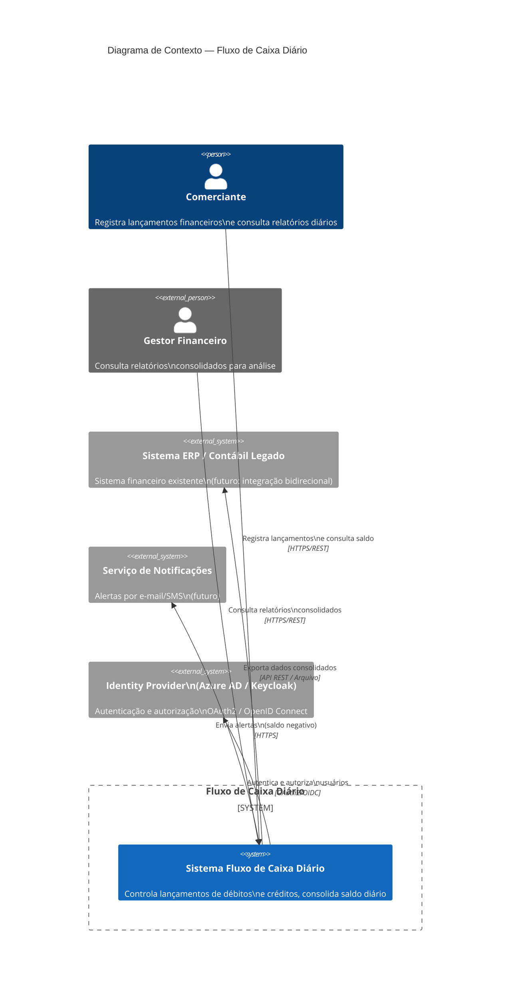

---

### 4.2 Nível 2 — Diagrama de Contêineres

> Detalha os contêineres (aplicações, bancos de dados, message brokers) dentro do sistema.

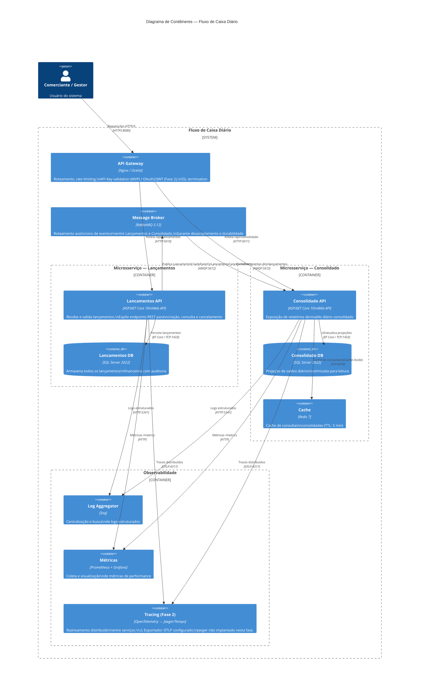

---

### 4.3 Nível 3 — Diagrama de Componentes: Serviço de Lançamentos

> Detalha os componentes internos do serviço de lançamentos.

```mermaid
C4Component
    title Componentes — Microsserviço de Lançamentos

    Container_Boundary(api, "Lancamentos API — ASP.NET Core 10") {

        Container_Boundary(presentation, "Camada de API") {
            Component(ctrl, "LancamentosController", "ASP.NET Core Controller", "Endpoints REST:\nPOST /lancamentos\nGET /lancamentos\nGET /lancamentos/{id}\nDELETE /lancamentos/{id}")
            Component(mw_exc, "ExceptionMiddleware", "ASP.NET Middleware", "Trata exceções globalmente,\nformata Problem Details (RFC 7807)")
            Component(mw_auth, "ApiKeyAuthMiddleware", "ASP.NET Middleware", "Valida header X-Api-Key.\nBypass: /health, /metrics, /swagger.\nLog de tentativas inválidas")
            Component(mw_rate, "RateLimitMiddleware", "ASP.NET Middleware", "Rate limiting por IP/usuário")
        }

        Container_Boundary(application, "Camada de Aplicação") {
            Component(med, "MediatR Pipeline", "MediatR 12", "Dispatcher de Commands e Queries.\nBehaviors: Validation → Logging → Audit → Handler")
            Component(beh_val, "ValidationBehavior", "IPipelineBehavior", "FluentValidation antes do handler")
            Component(beh_log, "LoggingBehavior", "IPipelineBehavior", "Log estruturado de entrada/saída")
            Component(beh_aud, "AuditBehavior", "IPipelineBehavior", "Intercepta Commands (*.Commands.*)\nRegistra AuditLog com duração,\ncorrelationId e payload JSON")
            Component(cmd_criar, "CriarLancamentoHandler", "IRequestHandler", "Cria agregado Lancamento.\nVerifica IdempotencyKey antes de criar.\nPersiste via Outbox (mesma transação)")
            Component(cmd_cancel, "CancelarLancamentoHandler", "IRequestHandler", "Cancela lançamento por ID,\npublica evento de cancelamento")
            Component(qry_list, "ListarLancamentosHandler", "IRequestHandler", "Consulta paginada com filtros\npor data, tipo e status")
            Component(qry_id, "ObterLancamentoPorIdHandler", "IRequestHandler", "Consulta lançamento por ID")
            Component(val, "FluentValidation Validators", "AbstractValidator<T>", "Regras de negócio e\nvalidação de entrada")
            Component(iaud_ctx, "IAuditContextAccessor", "Interface", "Abstrai contexto HTTP da Application.\nExpe: CorrelationId e UsuarioOuChave")
            Component(iaud_repo, "IAuditRepository", "Interface", "Contrato de persistência de AuditLog")
        }

        Container_Boundary(domain, "Camada de Domínio") {
            Component(agg, "Lancamento (Aggregate Root)", "C# class", "Entidade raiz com regras de negócio.\nControla estado: Pendente→Confirmado→Cancelado")
            Component(vo_valor, "Valor (Value Object)", "C# record", "Encapsula valor monetário,\ngarante positivo e máximo 2 decimais")
            Component(dom_evt, "Domain Events", "IDomainEvent", "LancamentoCriadoEvent\nLancamentoCanceladoEvent")
        }

        Container_Boundary(infra, "Camada de Infraestrutura") {
            Component(repo, "LancamentoRepository", "ILancamentoRepository", "CRUD via Entity Framework Core.\nUoW implícito no DbContext")
            Component(audit_repo, "AuditRepository", "IAuditRepository", "Persiste AuditLog via LancamentosDbContext")
            Component(audit_ctx, "HttpAuditContextAccessor", "IAuditContextAccessor", "Lê X-Correlation-Id e X-Api-Key\n(mascarado) do IHttpContextAccessor")
            Component(db_ctx, "LancamentosDbContext", "DbContext EF Core 10", "Tabelas: Lancamentos, OutboxMessages,\nAuditLogs. Migrations versionadas.")
            Component(pub, "LancamentoEventPublisher", "IEventPublisher", "Publica Integration Events\nno RabbitMQ via MassTransit")
            Component(out, "OutboxProcessor", "BackgroundService", "Processa OutboxMessages pendentes.\nGarante entrega mesmo se broker estiver off.")
        }
    }

    ContainerDb(db, "Lancamentos DB", "SQL Server")
    Container(broker, "RabbitMQ", "Message Broker")

    Rel(ctrl, med, "Envia Command/Query", "in-process")
    Rel(med, beh_val, "1º: Valida", "in-process")
    Rel(beh_val, beh_log, "2º: Loga", "in-process")
    Rel(beh_log, beh_aud, "3º: Audit", "in-process")
    Rel(beh_aud, cmd_criar, "Despacha", "in-process")
    Rel(beh_aud, cmd_cancel, "Despacha", "in-process")
    Rel(beh_aud, qry_list, "Despacha", "in-process")
    Rel(beh_aud, qry_id, "Despacha", "in-process")
    Rel(beh_aud, iaud_repo, "Persiste AuditLog", "in-process")
    Rel(beh_aud, iaud_ctx, "Lê contexto HTTP", "in-process")
    Rel(iaud_ctx, audit_ctx, "Implementa", "in-process")
    Rel(iaud_repo, audit_repo, "Implementa", "in-process")
    Rel(cmd_criar, val, "Valida", "in-process")
    Rel(cmd_criar, agg, "Cria agregado", "in-process")
    Rel(cmd_criar, repo, "Persiste", "in-process")
    Rel(cmd_criar, pub, "Publica evento", "in-process")
    Rel(agg, dom_evt, "Gera eventos", "in-process")
    Rel(repo, db_ctx, "Usa", "in-process")
    Rel(audit_repo, db_ctx, "Usa", "in-process")
    Rel(db_ctx, db, "SQL", "TCP")
    Rel(out, db_ctx, "SELECT unprocessed", "in-process")
    Rel(pub, broker, "AMQP Publish", "TCP:5672")
```

---

### 4.4 Nível 3 — Diagrama de Componentes: Serviço de Consolidado

```mermaid
C4Component
    title Componentes — Microsserviço de Consolidado Diário

    Container_Boundary(api, "Consolidado API — ASP.NET Core 10") {

        Container_Boundary(presentation, "Camada de API") {
            Component(ctrl, "ConsolidadoController", "ASP.NET Core Controller", "Endpoints REST:\nGET /consolidado/{data}\nGET /consolidado?de=&ate=")
            Component(mw_exc, "ExceptionMiddleware", "ASP.NET Middleware", "Trata exceções globalmente")
            Component(mw_auth, "ApiKeyAuthMiddleware", "ASP.NET Middleware", "Valida header X-Api-Key.\nBypass: /health, /metrics, /swagger.")
            Component(mw_cache_ctrl, "CacheControlMiddleware", "ASP.NET Middleware", "Adiciona headers Cache-Control\nnas respostas HTTP")
        }

        Container_Boundary(application, "Camada de Aplicação") {
            Component(med, "MediatR Pipeline", "MediatR 12", "Pipeline com behaviors\nde cache, logging e tracing")
            Component(qry_dia, "ObterConsolidadoDiarioHandler", "IRequestHandler", "Consulta com Cache-Aside:\n1. Verifica Redis\n2. Se miss, consulta DB\n3. Popula cache")
            Component(qry_periodo, "ObterHistoricoHandler", "IRequestHandler", "Consulta período\ncom paginação")
            Component(iaud_repo, "IAuditRepository", "Interface", "Contrato de persistência de AuditLog")
            Component(iaud_ctx, "IAuditContextAccessor", "Interface", "Fornece CorrelationId e UsuarioOuChave\npara o contexto HTTP atual.")
        }

        Container_Boundary(domain, "Camada de Domínio") {
            Component(agg_cons, "ConsolidadoDiario (Aggregate)", "C# class", "Projeção do saldo diário.\nTotalCreditos, TotalDebitos, SaldoFinal")
        }

        Container_Boundary(infra, "Camada de Infraestrutura") {
            Component(evt_criado, "LancamentoCriadoConsumer", "IConsumer<T> MassTransit", "Verifica idempotência (EventoProcessado).\nAtualiza projeção do consolidado.\nRegistra AuditLog após processar.")
            Component(evt_cancel, "LancamentoCanceladoConsumer", "IConsumer<T> MassTransit", "Verifica idempotência (EventoProcessado).\nReverte lançamento no consolidado.\nRegistra AuditLog após processar.")
            Component(repo_cons, "ConsolidadoDiarioRepository", "IConsolidadoDiarioRepository", "CRUD via EF Core.\nQuerys otimizadas de leitura")
            Component(repo_evt, "EventoProcessadoRepository", "IEventoProcessadoRepository", "Verifica e persiste EventoProcessado.\nGarante idempotência do consumer.")
            Component(audit_repo, "AuditRepository", "IAuditRepository", "Persiste AuditLog via ConsolidadoDbContext")
            Component(http_audit_ctx, "HttpAuditContextAccessor", "IAuditContextAccessor", "Lê X-Correlation-Id e X-Api-Key\ndo HttpContext atual.")
            Component(cache_svc, "RedisCacheService", "ICacheService", "Cache-Aside via StackExchange.Redis.\nSer. JSON, TTL configurável")
            Component(cons_db_ctx, "ConsolidadoDbContext", "DbContext EF Core 10", "Tabelas: ConsolidadosDiarios,\nEventosProcessados, AuditLogs.")
            Component(circuit, "ResiliencePolicy", "Polly", "Circuit Breaker no Redis.\nFallback para DB direto")
        }
    }

    ContainerDb(db, "Consolidado DB", "SQL Server")
    Container(redis, "Redis Cache", "Redis 7")
    Container(broker, "RabbitMQ", "Message Broker")

    Rel(ctrl, med, "Envia Query", "in-process")
    Rel(med, qry_dia, "Despacha", "in-process")
    Rel(med, qry_periodo, "Despacha", "in-process")
    Rel(qry_dia, cache_svc, "Cache-Aside lookup", "in-process")
    Rel(cache_svc, redis, "GET/SET", "TCP:6379")
    Rel(qry_dia, repo_cons, "Query (cache miss)", "in-process")
    Rel(repo_cons, cons_db_ctx, "Usa", "in-process")
    Rel(cons_db_ctx, db, "SQL", "TCP")
    Rel(broker, evt_criado, "Consome LancamentoCriadoEvent", "AMQP")
    Rel(broker, evt_cancel, "Consome LancamentoCanceladoEvent", "AMQP")
    Rel(evt_criado, repo_evt, "Verifica/Persiste EventoProcessado", "in-process")
    Rel(evt_cancel, repo_evt, "Verifica/Persiste EventoProcessado", "in-process")
    Rel(evt_criado, repo_cons, "Upsert consolidado", "in-process")
    Rel(evt_criado, cache_svc, "Invalida cache do dia", "in-process")
    Rel(evt_cancel, repo_cons, "Reverte consolidado", "in-process")
    Rel(evt_cancel, cache_svc, "Invalida cache do dia", "in-process")
    Rel(evt_criado, iaud_repo, "Registra AuditLog", "in-process")
    Rel(evt_cancel, iaud_repo, "Registra AuditLog", "in-process")
    Rel(iaud_repo, audit_repo, "Implementa", "in-process")
    Rel(audit_repo, cons_db_ctx, "Usa", "in-process")
    Rel(repo_evt, cons_db_ctx, "Usa", "in-process")
    Rel(circuit, redis, "Protege falhas", "in-process")
```

---

### 4.5 Diagrama de Sequência — Registrar Lançamento

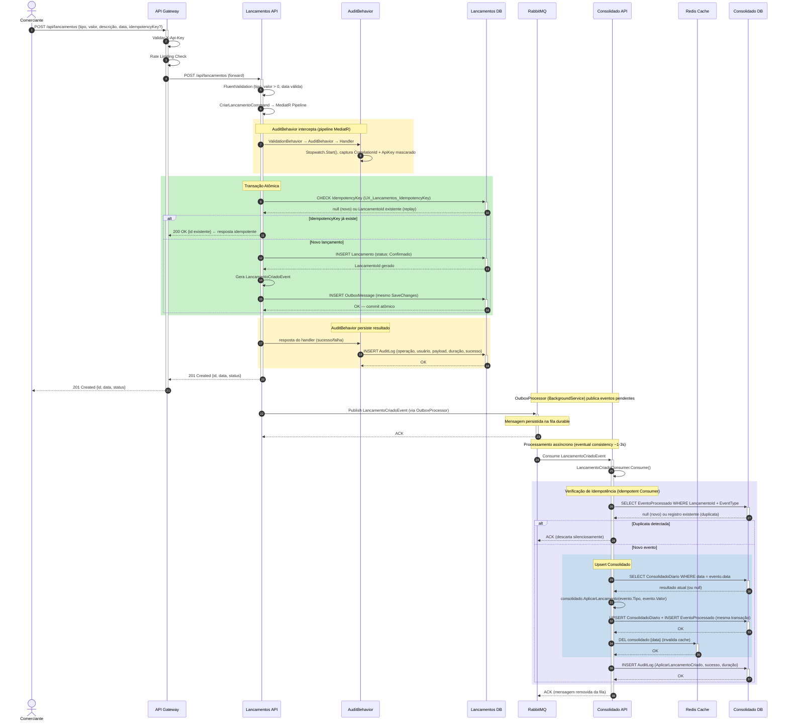

---

### 4.6 Diagrama de Sequência — Consultar Consolidado com Cache

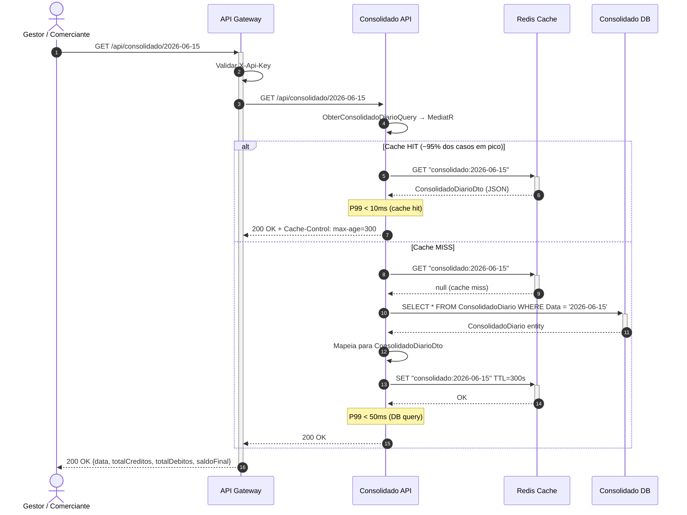

---

### 4.7 Diagrama de Resiliência — Cenário de Falha do Consolidado

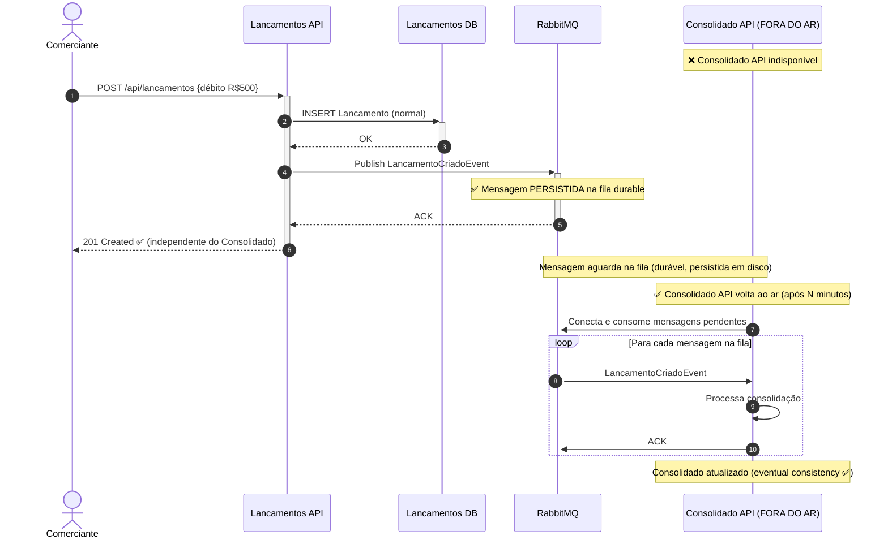

---

### 4.8 Diagrama de Dados — Modelo Conceitual

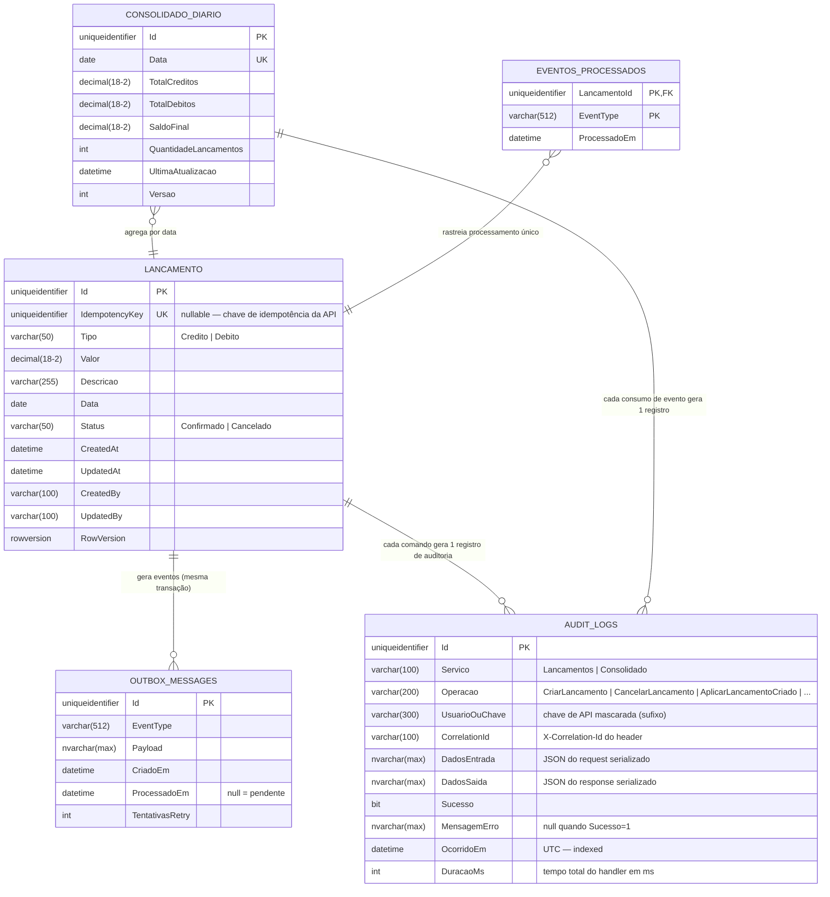

> **Nota sobre AUDIT_LOGS:** A tabela existe em ambos os bancos (Lançamentos DB e Consolidado DB), cada serviço registra suas próprias entradas. O `AuditBehavior` no pipeline MediatR persiste automaticamente toda operação de Command no Lançamentos; os consumers `LancamentoCriadoConsumer` e `LancamentoCanceladoConsumer` registram manualmente no Consolidado.

---

### 4.9 Diagrama de Infraestrutura — Deploy com Docker

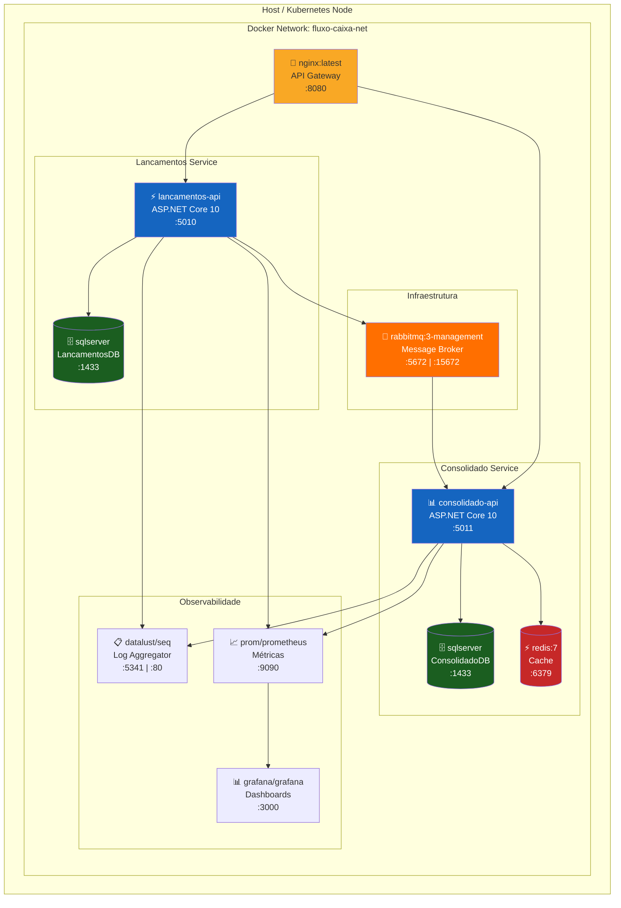

---

## 5. Arquitetura de Integração

### 5.1 Fluxo de Eventos

```
Lançamentos API
      │
      │  1. Persiste Lancamento no DB
      │  2. Publica Integration Event
      ▼
  RabbitMQ Exchange: "fluxo-caixa.lancamentos"
      │
      │  Routing Key: "lancamento.criado"
      │  Routing Key: "lancamento.cancelado"
      ▼
  Queue: "consolidado.lancamentos"
      │
      ▼
Consolidado API (Consumer)
      │
      │  3. Atualiza projeção ConsolidadoDiario
      │  4. Invalida cache Redis
      ▼
   Redis Cache (invalidado)
```

### 5.2 Contrato do Evento (Integration Event)

```json
{
  "$schema": "LancamentoCriadoIntegrationEvent/v1",
  "lancamentoId": "3fa85f64-5717-4562-b3fc-2c963f66afa6",
  "tipo": "Credito",
  "valor": 1500.00,
  "descricao": "Venda produto X",
  "data": "2026-06-15",
  "ocorridoEm": "2026-06-15T14:30:00Z",
  "versao": "1.0"
}
```

### 5.3 Padrões de Integração Utilizados

| Padrão | Aplicação |
|--------|-----------|
| **Publish-Subscribe** | Lançamentos publica; Consolidado assina |
| **Dead Letter Queue** | Mensagens com falha após 3 retries → DLQ |
| **Message Durability** | Filas e mensagens persistidas em disco |
| **Outbox Pattern** | `OutboxMessage` gravada na mesma transação do lançamento. `OutboxProcessor` (BackgroundService) publica no RabbitMQ. Garante que nenhum evento se perde mesmo que o broker esteja indisponível no momento da escrita. |
| **Idempotency Key** | `CriarLancamentoCommand` aceita `IdempotencyKey (Guid?)`. O handler retorna o lançamento existente sem criar duplicata. Índice único `UX_Lancamentos_IdempotencyKey` garante proteção contra race condition. |
| **Idempotent Consumer** | `EventoProcessado` (PK composta `LancamentoId + EventType`) persiste no Consolidado DB junto com o upsert do consolidado. Reprocessamento de mensagem (MassTransit retry, reinício de consumer) é detectado e descartado sem efeito colateral. |
| **Cache-Aside** | Consolidado usa Redis como cache lateral |
| **Circuit Breaker** | Polly protege chamadas ao Redis e ao DB |

---

## 6. Arquitetura de Segurança

### 6.1 Modelo Atual (MVP) — API Key Authentication

> A camada de segurança do MVP utiliza **API Key via header `X-Api-Key`** implementada como middleware ASP.NET Core em ambos os serviços. A decisão de adotar API Key em vez de OAuth2/JWT neste estágio está documentada em [ADR-006](adr/ADR-006-autenticacao-api-key.md).

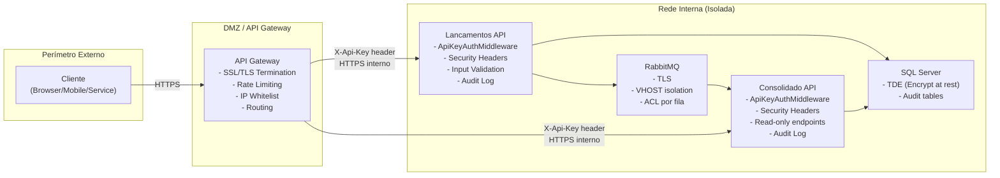

**Pipeline de segurança por requisição:**

```
Cliente
  │
  ▼ HTTPS (TLS 1.3)
API Gateway
  │ Rate limiting + IP filter
  ▼
ApiKeyAuthMiddleware ──► 401 Unauthorized (chave ausente/inválida)
  │                       + log IP no Serilog
  ▼ (chave válida)
Security Headers Middleware
  │ X-Content-Type-Options: nosniff
  │ X-Frame-Options: SAMEORIGIN
  │ X-XSS-Protection: 1; mode=block
  ▼
ExceptionHandlingMiddleware
  ▼
Controller → Application → Domain
```

**Configuração da chave:**

| Ambiente | Fonte da chave |
|----------|----------------|
| Desenvolvimento | `appsettings.json` → `ApiKey:Key` |
| Staging/Prod | Variável de ambiente `ApiKey__Key` ou Secret Manager |

**Endpoints isentos de autenticação:**

| Endpoint | Motivo |
|----------|--------|
| `GET /health` | Probe de saúde do Kubernetes/Docker Compose |
| `GET /metrics` | Scraping do Prometheus (rede interna) |
| `GET /swagger/**` | Developer experience (apenas em Development) |

---

### 6.2 Modelo Alvo (Fase 2) — OAuth2/JWT

Quando um Identity Provider (Keycloak ou Azure AD B2C) estiver disponível, a migração consiste em:
1. Substituir `ApiKeyAuthMiddleware` por `AddAuthentication().AddJwtBearer(...)`
2. Adicionar `[Authorize]` nos controllers ou usar autorização por policy
3. Configurar escopos por role no IdP

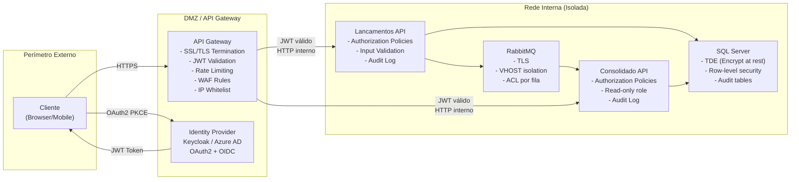

**Modelo de Autorização RBAC (Fase 2):**

| Role | Lançamentos | Consolidado |
|------|-------------|-------------|
| `lancamentos:write` | POST, DELETE | — |
| `lancamentos:read` | GET | — |
| `consolidado:read` | — | GET |
| `admin` | Full access | Full access |

> Detalhamento da decisão: [ADR-006 — Autenticação por API Key](adr/ADR-006-autenticacao-api-key.md)

---

## 7. Estratégia de Escalabilidade

### 7.1 Análise de Carga

| Serviço | Carga Normal | Pico | Estratégia |
|---------|-------------|------|------------|
| Lancamentos API | ~5 req/s | ~20 req/s | Horizontal (2 réplicas) |
| Consolidado API | ~10 req/s | **50 req/s** | Horizontal (4 réplicas) + Redis |
| RabbitMQ | ~20 msg/s | ~20 msg/s | Cluster 3 nós |
| Redis | ~60 req/s | ~50 req/s | Redis Cluster |

### 7.2 Como o RNF-02 (50 req/s, ≤5% perda) é Atendido

```
Carga de 50 req/s no Consolidado API:

Sem cache:    50 req/s × 50ms (DB query) = 2.500ms fila
Com cache:    ~95% cache hit × 5ms = 2.5ms (efetivo ~2.5ms)
             ~5% cache miss × 50ms = 2.5ms

Taxa real de consultas ao DB: 2.5 req/s (95% servidos pelo Redis)

Capacidade do sistema:
- 4 réplicas × ~100 req/s (ASP.NET) = 400 req/s
- Redis: >100.000 ops/s
- RNF atendido com folga de 8x
```

### 7.3 Kubernetes HPA (Futuro)

```yaml
# Exemplo HPA para Consolidado
apiVersion: autoscaling/v2
kind: HorizontalPodAutoscaler
spec:
  minReplicas: 2
  maxReplicas: 10
  metrics:
  - type: Resource
    resource:
      name: cpu
      target:
        averageUtilization: 70
  - type: Pods
    pods:
      metric:
        name: http_requests_per_second
      target:
        averageValue: "40"
```

---

## 8. Estratégia de Resiliência

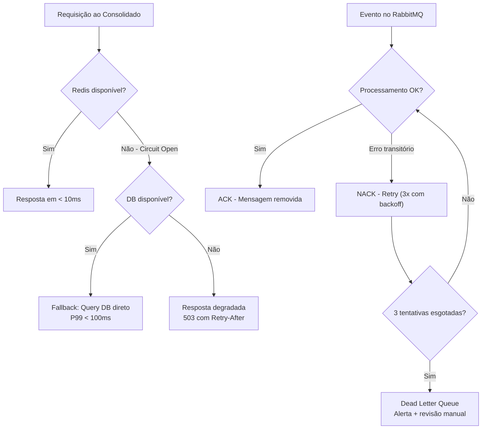

**Políticas Polly Configuradas:**

| Política | Configuração |
|----------|-------------|
| Retry | 3 tentativas, exponential backoff (1s, 2s, 4s) |
| Circuit Breaker | Abre com 50% de falhas em 30s; recupera em 60s |
| Timeout | 5s para consultas ao DB; 500ms para Redis |
| Bulkhead | Semáforo de 10 chamadas concorrentes ao DB |

---

## 9. Monitoramento e Observabilidade

### 9.1 Três Pilares da Observabilidade

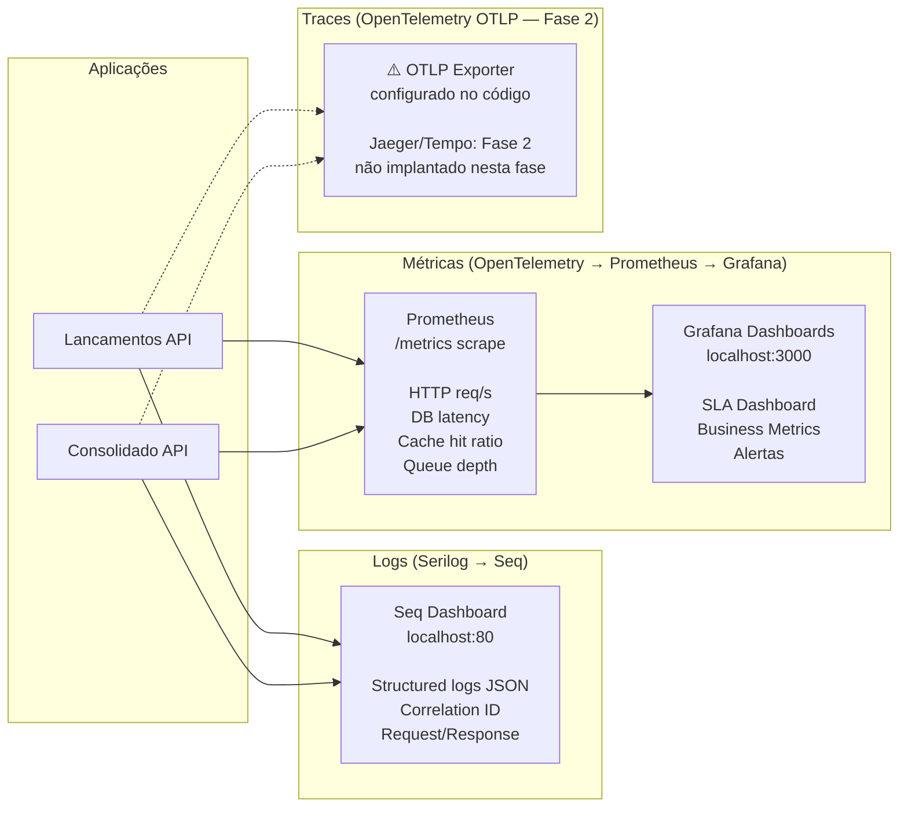

### 9.2 Métricas de Negócio (Golden Signals)

| Métrica | Descrição | Alerta |
|---------|-----------|--------|
| `lancamentos_criados_total` | Total de lançamentos criados (por `tipo`) | — |
| `lancamentos_cancelados_total` | Total de lançamentos cancelados | — |
| `consolidado_cache_hits_total` | Leituras atendidas pelo Redis (cache hit) | < 80% hit ratio |
| `consolidado_cache_misses_total` | Leituras não encontradas no Redis (cache miss) | — |
| `consolidacoes_processadas_total` | Eventos de lançamento processados pelo Consolidado | — |
| `http_server_request_duration_seconds` | Latência P99 das requisições HTTP | P99 > 500ms |
| `queue_depth_lancamentos` | Profundidade da fila RabbitMQ | > 100 msgs |
| `eventos_dlq_total` | Eventos na Dead Letter Queue | > 0 |

### 9.3 Estrutura de Log (Serilog)

```json
{
  "timestamp": "2026-06-15T14:30:00.123Z",
  "level": "Information",
  "message": "Lançamento criado com sucesso",
  "correlationId": "abc-123",
  "serviceName": "Lancamentos.API",
  "lancamentoId": "3fa85f64-...",
  "tipo": "Credito",
  "valor": 1500.00,
  "duracao_ms": 45,
  "userId": "user@empresa.com"
}
```

---

## 10. Arquitetura de Transição (Legado → Target)

> Cenário: a empresa possui um sistema monolítico legado que controla lançamentos em planilhas ou ERP antigo.

### Fase 1 — Operação Paralela (0-3 meses)

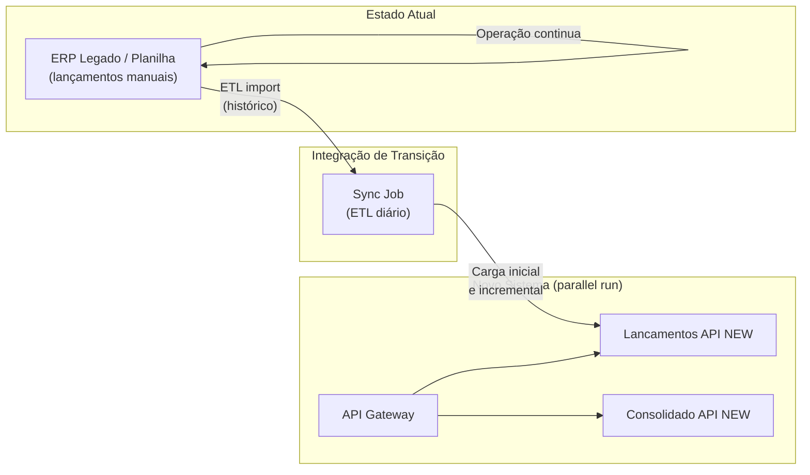

### Fase 2 — Strangler Fig (3-6 meses)

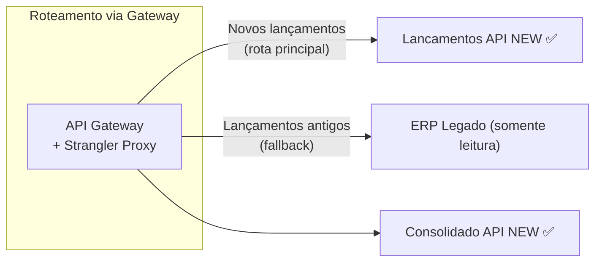

### Fase 3 — Aposentadoria do Legado (6+ meses)

- Migração completa do histórico
- Desativação do ERP legado para lançamentos
- 100% do tráfego no novo sistema

---

## 11. Estimativa de Custos (Azure — Ambiente Produção)

### 11.1 Infraestrutura Mínima (Startup)

| Componente | Serviço Azure | SKU | Custo/mês (USD) |
|------------|---------------|-----|-----------------|
| API (2 serviços) | Azure Container Apps | 2× Consumption | ~$30 |
| SQL Server | Azure SQL Database | S1 2×DTU (Basic) | ~$30 |
| Redis | Azure Cache for Redis | C1 Basic 1GB | ~$55 |
| RabbitMQ | Azure Service Bus | Standard | ~$10 |
| Logs | Azure Monitor / Log Analytics | Pay-per-use 5GB | ~$15 |
| Gateway | Azure API Management | Consumption | ~$10 |
| **Total Estimado** | | | **~$150/mês** |

### 11.2 Infraestrutura Produção (Scale)

| Componente | Serviço Azure | SKU | Custo/mês (USD) |
|------------|---------------|-----|-----------------|
| API (2 serviços, 4 réplicas) | AKS | 4× D2s_v3 | ~$280 |
| SQL Server | Azure SQL Database | S3 100DTU × 2 | ~$300 |
| Redis | Azure Cache for Redis | C2 Standard 6GB | ~$140 |
| RabbitMQ | Azure Service Bus | Premium | ~$670 |
| Logs + APM | Azure Monitor | 20GB/mês | ~$50 |
| Gateway | Azure API Management | Developer | ~$50 |
| **Total Estimado** | | | **~$1.490/mês** |

---

## 12. Riscos e Mitigações

| # | Risco | Probabilidade | Impacto | Mitigação |
|---|-------|--------------|---------|-----------|
| R1 | Consistência eventual — consolidado desatualizado | Média | Médio | TTL curto no cache (5min), monitorar queue depth |
| R2 | RabbitMQ como SPOF | Baixa | Alto | Cluster 3 nós, durable queues, mensagens persistidas |
| R3 | Explosão de eventos na fila (Lancamentos sem consumidor) | Baixa | Médio | Dead Letter Queue + alertas + retry policy |
| R4 | Cache poisoning / dados desatualizados | Baixa | Médio | Invalidação por evento, TTL forçado |
| R5 | Segurança — dados financeiros expostos | Baixa | Alto | TLS end-to-end, **API Key Auth (MVP)**, OAuth2/JWT (Fase 2), TDE no banco, security headers |
| R6 | Drift de schema entre serviços | Média | Alto | Versionamento de eventos, schema registry |

---

## 13. Roadmap de Evolução

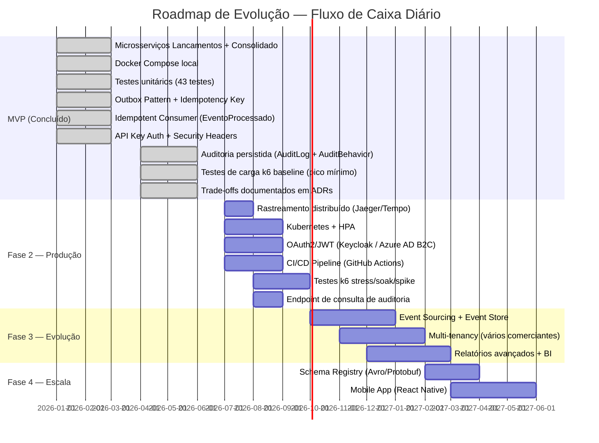

---

## Apêndice A — Decisões Arquiteturais Registradas (ADRs)

| ADR | Título | Status |
|-----|--------|--------|
| [ADR-001](adr/ADR-001-microservicos.md) | Adotar Arquitetura de Microsserviços | Aprovado |
| [ADR-002](adr/ADR-002-mensageria.md) | RabbitMQ + MassTransit para Mensageria | Aprovado |
| [ADR-003](adr/ADR-003-persistencia.md) | SQL Server com EF Core por Serviço | Aprovado |
| [ADR-004](adr/ADR-004-cache.md) | Redis com Cache-Aside no Consolidado | Aprovado |
| [ADR-005](adr/ADR-005-observabilidade.md) | OpenTelemetry + Serilog + Prometheus | Aprovado |
| [ADR-006](adr/ADR-006-autenticacao-api-key.md) | Autenticação por API Key (baseline MVP) | Aprovado |
| [ADR-007](adr/ADR-007-rate-limiting.md) | Rate Limiting nativo ASP.NET Core 10 | Aprovado |

---

## Apêndice B — Glossário

| Termo | Definição |
|-------|-----------|
| **Lançamento** | Registro financeiro de uma entrada (crédito) ou saída (débito) |
| **Consolidado Diário** | Agregação de todos os lançamentos de um dia, com saldo líquido |
| **Integration Event** | Evento publicado no broker para comunicação entre microsserviços |
| **Domain Event** | Evento interno ao domínio de um serviço |
| **Outbox Pattern** | Padrão para garantir entrega de mensagens junto com a transação do DB |
| **Circuit Breaker** | Padrão de resiliência que "abre o circuito" após falhas consecutivas |
| **Cache-Aside** | Padrão onde a aplicação gerencia leitura/escrita no cache explicitamente |
| **Strangler Fig** | Padrão de migração gradual de um sistema legado |
| **API Key** | Credencial de acesso compartilhada (segredo), transmitida via header `X-Api-Key` |
| **Idempotency Key** | Chave única por requisição para garantir processamento sem duplicatas |
| **Bounded Context** | Limite explícito onde um modelo de domínio se aplica (DDD) |