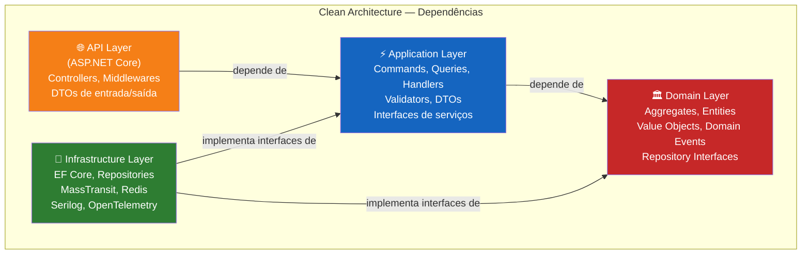
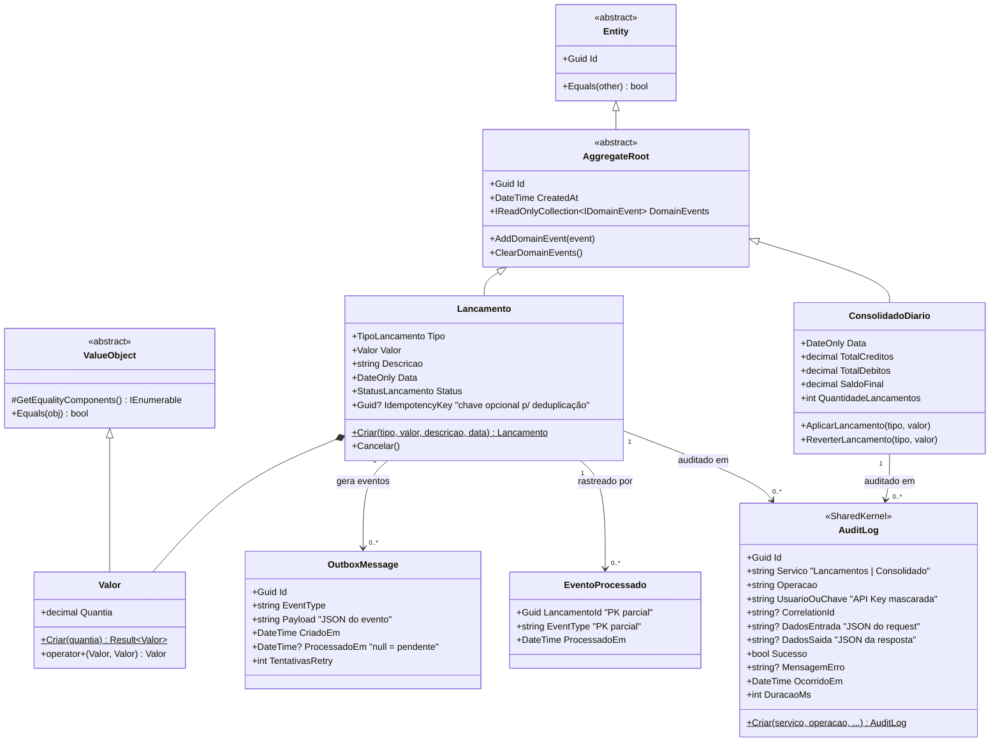
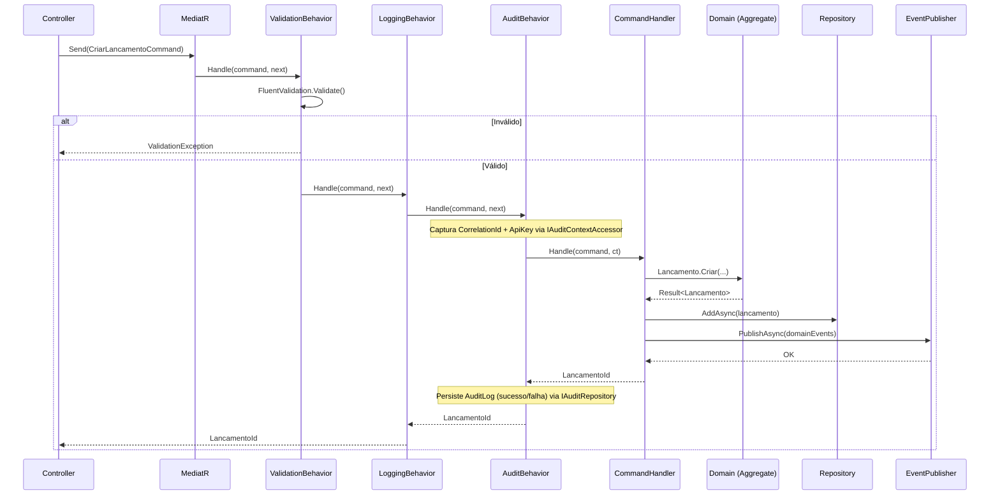
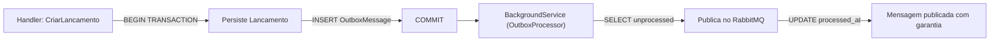

# Arquitetura de Software — Fluxo de Caixa Diário

> **Versão:** 2.0.0 | **Data:** Junho 2026
> **Audience:** Desenvolvedores, Tech Leads, Software Architects

---

## 1. Visão Geral

A arquitetura de software adota **Clean Architecture** combinada com **Domain-Driven Design (DDD)** e **CQRS** para cada microsserviço. Essa combinação garante:

- **Alta testabilidade**: cada camada pode ser testada isoladamente
- **Independência de frameworks**: a lógica de negócio não depende de ASP.NET, EF Core ou RabbitMQ
- **Evolução segura**: mudanças de infraestrutura não afetam o domínio
- **Leitura e escrita otimizadas**: CQRS separa modelos de escrita e leitura

---

## 2. Clean Architecture



**Regra fundamental:** as dependências apontam **sempre para dentro** (em direção ao Domain). O Domain nunca conhece Application, Infrastructure ou API.

### 2.1 Responsabilidades por Camada

| Camada | Responsabilidade | Não deve conter |
|--------|----------------|----------------|
| **Domain** | Entidades, agregados, value objects, regras de negócio, eventos de domínio | Referências a EF Core, HTTP, MassTransit |
| **Application** | Casos de uso (Commands/Queries), orquestração, validação, DTOs | Lógica de negócio pura, detalhes de infra |
| **Infrastructure** | Implementações: repositórios EF, publishers MassTransit, Redis, Serilog | Regras de negócio |
| **API** | Controllers, **middlewares de segurança** (ApiKey, ExceptionHandling), security headers, configuração de DI, Swagger | Lógica de negócio, acesso direto a dados |

---

## 3. Domain-Driven Design (DDD)

### 3.1 Padrões Táticos Utilizados



### 3.2 Aggregate: Lancamento

```csharp
// Invariantes do Aggregate Lancamento:
// 1. Valor deve ser positivo
// 2. Data não pode ser mais de 30 dias no passado (regra de negócio)
// 3. Lançamento cancelado não pode ser re-ativado
// 4. Ao criar, gera LancamentoCriadoEvent
// 5. Ao cancelar, gera LancamentoCanceladoEvent

public sealed class Lancamento : AggregateRoot
{
    private Lancamento() { } // EF Core

    public static Result<Lancamento> Criar(
        TipoLancamento tipo, Valor valor,
        string descricao, DateOnly data)
    {
        // Enforce invariants → gera Domain Event → retorna Result
    }

    public Result Cancelar()
    {
        if (Status == StatusLancamento.Cancelado)
            return Result.Failure("Lançamento já cancelado");
        Status = StatusLancamento.Cancelado;
        AddDomainEvent(new LancamentoCanceladoEvent(Id, Data, Tipo, Valor.Quantia));
        return Result.Success();
    }
}
```

### 3.3 Value Object: Valor

```csharp
// Value Object encapsula valor monetário
// Garante imutabilidade e igualdade por valor (não por referência)

public sealed record Valor : ValueObject
{
    public decimal Quantia { get; }

    private Valor(decimal quantia) => Quantia = quantia;

    public static Result<Valor> Criar(decimal quantia)
    {
        if (quantia <= 0) return Result.Failure<Valor>("Valor deve ser positivo");
        if (decimal.Round(quantia, 2) != quantia)
            return Result.Failure<Valor>("Valor não pode ter mais de 2 casas decimais");
        return Result.Success(new Valor(quantia));
    }
}
```

---

## 4. CQRS com MediatR

### 4.1 Fluxo de Command



### 4.2 Pipeline Behaviors

```csharp
// Ordem de execução do pipeline MediatR:
// Request → [ValidationBehavior] → [LoggingBehavior] → [AuditBehavior] → Handler → Response

// 1. ValidationBehavior: valida o command antes de processar (FluentValidation)
// 2. LoggingBehavior: loga entrada/saída com duração e correlation-id
// 3. AuditBehavior: intercepta apenas Commands (namespace *.Commands.*)
//    - Captura CorrelationId e ApiKey (mascarada) via IAuditContextAccessor
//    - Serializa request/response como JSON
//    - Persiste AuditLog via IAuditRepository (sucesso ou falha)
//    - Mede duração total com Stopwatch
//    - Não intercepta Queries (read-only não auditado)
```

> **Nota de desacoplamento:** `AuditBehavior` depende apenas de `IAuditContextAccessor` e `IAuditRepository` — ambas interfaces da camada Application. A implementação HTTP (`HttpAuditContextAccessor`) fica na Infrastructure, garantindo que a Application nunca importe `Microsoft.AspNetCore.Http`.

### 4.3 Separação de Modelos: Write vs Read

| Aspecto | Write Model (Commands) | Read Model (Queries) |
|---------|----------------------|---------------------|
| Objeto | `Lancamento` Aggregate | `LancamentoDto` / projeção |
| Persistência | `LancamentosDbContext` | `LancamentosDbContext` (read-only) |
| Otimização | Integridade transacional | Leitura rápida, paginação |
| Validação | Domain invariants + FluentValidation | Apenas parâmetros de busca |

---

## 5. Estrutura de Projetos

```
src/
├── Shared/
│   └── FluxoCaixaDiario.SharedKernel/
│       ├── Domain/
│       │   ├── Entity.cs                    # Base para entidades
│       │   ├── AggregateRoot.cs             # Base para raízes de agregado
│       │   ├── ValueObject.cs               # Base para value objects
│       │   └── IDomainEvent.cs              # Interface de domain events
│       ├── Events/
│       │   ├── LancamentoCriadoIntegrationEvent.cs   # Contrato de evento
│       │   └── LancamentoCanceladoIntegrationEvent.cs
│       ├── Audit/
│       │   └── AuditLog.cs                  # ★ Entidade de auditoria compartilhada
│       └── Result/
│           └── Result.cs                    # Result pattern (sem exceções)
│
├── Lancamentos/
│   ├── FluxoCaixaDiario.Lancamentos.Domain/
│   │   ├── Entities/
│   │   │   └── Lancamento.cs               # Aggregate Root (+ IdempotencyKey)
│   │   ├── Enums/
│   │   │   ├── TipoLancamento.cs
│   │   │   └── StatusLancamento.cs
│   │   ├── Events/
│   │   │   ├── LancamentoCriadoEvent.cs    # Domain Event (interno)
│   │   │   └── LancamentoCanceladoEvent.cs
│   │   ├── Repositories/
│   │   │   └── ILancamentoRepository.cs    # Interface (contrato)
│   │   ├── ValueObjects/
│   │   │   └── Valor.cs
│   │   └── Exceptions/
│   │       └── LancamentoDomainException.cs
│   │
│   ├── FluxoCaixaDiario.Lancamentos.Application/
│   │   ├── Commands/
│   │   │   ├── CriarLancamento/
│   │   │   │   ├── CriarLancamentoCommand.cs
│   │   │   │   ├── CriarLancamentoCommandHandler.cs
│   │   │   │   └── CriarLancamentoCommandValidator.cs
│   │   │   └── CancelarLancamento/
│   │   │       ├── CancelarLancamentoCommand.cs
│   │   │       └── CancelarLancamentoCommandHandler.cs
│   │   ├── Queries/
│   │   │   ├── ObterLancamentos/
│   │   │   │   ├── ObterLancamentosQuery.cs
│   │   │   │   └── ObterLancamentosQueryHandler.cs
│   │   │   └── ObterLancamentoPorId/
│   │   │       ├── ObterLancamentoPorIdQuery.cs
│   │   │       └── ObterLancamentoPorIdQueryHandler.cs
│   │   ├── Behaviors/
│   │   │   ├── ValidationBehavior.cs
│   │   │   ├── LoggingBehavior.cs
│   │   │   └── AuditBehavior.cs             # ★ Intercepta Commands → persiste AuditLog
│   │   ├── Interfaces/
│   │   │   ├── IEventPublisher.cs
│   │   │   ├── IAuditRepository.cs          # ★ Contrato de auditoria (desacoplado)
│   │   │   └── IAuditContextAccessor.cs     # ★ Abstrai HTTP da camada Application
│   │   ├── DTOs/
│   │   │   ├── LancamentoDto.cs
│   │   │   └── CriarLancamentoRequest.cs
│   │   └── DependencyInjection.cs
│   │
│   ├── FluxoCaixaDiario.Lancamentos.Infrastructure/
│   │   ├── Persistence/
│   │   │   ├── LancamentosDbContext.cs      # DbSet: Lancamentos, OutboxMessages, AuditLogs
│   │   │   ├── Configurations/
│   │   │   │   ├── LancamentoConfiguration.cs
│   │   │   │   └── AuditLogConfiguration.cs # ★ Mapeamento EF para AuditLogs
│   │   │   ├── Migrations/
│   │   │   │   ├── 20260610120000_AddAuditLog.cs   # ★ Migração de auditoria
│   │   │   │   └── LancamentosDbContextModelSnapshot.cs
│   │   │   └── Repositories/
│   │   │       ├── LancamentoRepository.cs
│   │   │       └── AuditRepository.cs       # ★ Implementação de IAuditRepository
│   │   ├── Messaging/
│   │   │   └── LancamentoEventPublisher.cs
│   │   ├── HttpAuditContextAccessor.cs      # ★ Lê X-Correlation-Id e X-Api-Key
│   │   └── DependencyInjection.cs
│   │
│   └── FluxoCaixaDiario.Lancamentos.API/
│       ├── Controllers/
│       │   └── LancamentosController.cs
│       ├── Middlewares/
│       │   └── ExceptionHandlingMiddleware.cs
│       ├── Program.cs                       # AddHttpContextAccessor() registrado aqui
│       └── appsettings.json
│
└── Consolidado/
    ├── FluxoCaixaDiario.Consolidado.Domain/
    ├── FluxoCaixaDiario.Consolidado.Application/
    │   ├── DependencyInjection.cs               # Registra MediatR, ConsolidadoMetrics
    │   ├── DTOs/
    │   │   └── ConsolidadoDiarioDto.cs
    │   ├── Interfaces/
    │   │   ├── IAuditRepository.cs              # Contrato de auditoria do Consolidado
    │   │   └── ICacheService.cs                 # Abstração do cache Redis
    │   ├── Metrics/
    │   │   └── ConsolidadoMetrics.cs            # ★ Métricas: cache_hits, cache_misses, consolidacoes_processadas
    │   └── Queries/
    │       ├── ObterConsolidadoDiario/
    │       │   ├── ObterConsolidadoDiarioQuery.cs
    │       │   └── ObterConsolidadoDiarioQueryHandler.cs
    │       └── ObterHistorico/
    │           ├── ObterHistoricoConsolidadoQuery.cs
    │           └── ObterHistoricoConsolidadoQueryHandler.cs
    ├── FluxoCaixaDiario.Consolidado.Infrastructure/
    │   ├── Persistence/
    │   │   ├── ConsolidadoDbContext.cs       # DbSet: ConsolidadosDiarios, EventosProcessados, AuditLogs
    │   │   ├── Configurations/
    │   │   │   └── AuditLogConfiguration.cs # ★
    │   │   ├── Migrations/
    │   │   │   └── 20260610120001_AddAuditLog.cs   # ★
    │   │   └── Repositories/
    │   │       └── AuditRepository.cs       # ★
    │   └── Messaging/
    │       ├── LancamentoCriadoConsumer.cs  # ★ Registra AuditLog após processar
    │       └── LancamentoCanceladoConsumer.cs # ★ Registra AuditLog após processar
    └── FluxoCaixaDiario.Consolidado.API/

tests/
├── FluxoCaixaDiario.Lancamentos.UnitTests/  # 43 testes — domain + application
├── FluxoCaixaDiario.Consolidado.UnitTests/
└── k6/
    ├── lancamentos-baseline.js              # ★ Teste de carga — pico de escrita
    ├── consolidado-baseline.js             # ★ Teste de carga — pico de leitura (50 req/s)
    └── README.md                           # ★ Como executar + thresholds + roadmap de testes futuros
```

---

## 6. Design de API (REST)

### 6.1 Convenções

| Aspecto | Convenção |
|---------|-----------|
| Nomenclatura de recursos | Substantivos no plural: `/lancamentos`, `/consolidado` |
| Verbos HTTP | POST=criar, GET=ler, DELETE=cancelar (sem PATCH/PUT neste MVP) |
| Formato de data | ISO 8601: `yyyy-MM-dd` na URL, `yyyy-MM-ddTHH:mm:ssZ` no payload |
| Paginação | Query params: `pagina=1&tamanhoPagina=20` |
| Formato de erros | RFC 7807 Problem Details |
| Versionamento | URL path: `/v1/lancamentos` (implementar a partir da v2) |

### 6.2 Contratos de API

**POST /api/lancamentos**
```json
// Request
{
  "tipo": "Credito",  // "Credito" | "Debito"
  "valor": 1500.00,
  "descricao": "Venda produto X",
  "data": "2024-01-15"
}

// Response 201 Created
{
  "id": "3fa85f64-5717-4562-b3fc-2c963f66afa6",
  "tipo": "Credito",
  "valor": 1500.00,
  "descricao": "Venda produto X",
  "data": "2024-01-15",
  "status": "Confirmado",
  "criadoEm": "2024-01-15T14:30:00Z"
}
```

**GET /api/consolidado/2024-01-15**
```json
// Response 200 OK
{
  "data": "2024-01-15",
  "totalCreditos": 2500.00,
  "totalDebitos": 800.00,
  "saldoFinal": 1700.00,
  "quantidadeLancamentos": 5,
  "ultimaAtualizacao": "2024-01-15T18:30:00Z"
}
```

**Erro (RFC 7807 Problem Details)**
```json
// Response 422 Unprocessable Entity
{
  "type": "https://fluxocaixa.api/errors/validation",
  "title": "Erro de validação",
  "status": 422,
  "detail": "Um ou mais campos são inválidos",
  "errors": {
    "valor": ["O valor deve ser maior que zero"],
    "tipo": ["O tipo deve ser 'Credito' ou 'Debito'"]
  }
}
```

---

## 7. Estratégia de Testes

### 7.1 Pirâmide de Testes

```
                    /\
                   /  \
                  / E2E \      ← Poucos (alto custo, lento)
                 /------\
                / Integr. \    ← Médios (banco em memória)
               /----------\
              /  Unitários  \  ← Muitos (rápidos, isolados)
             /--------------\
```

### 7.2 Cobertura por Camada

| Camada | Tipo de Teste | Foco | Ferramentas |
|--------|-------------|------|-------------|
| **Domain** | Unitários | Invariantes, state transitions, value objects | xUnit, FluentAssertions |
| **Application** | Unitários | Command/Query handlers, validators, behaviors | xUnit, Moq, FluentAssertions |
| **Infrastructure** | Integração | Repositórios, EF Core | xUnit, EF InMemory / Testcontainers |
| **API** | Integração | Controllers, middleware, problem details | xUnit, WebApplicationFactory |
| **End-to-End** | E2E (futuro) | Fluxos completos com Docker | Playwright, k6 |

### 7.3 Exemplos de Cenários de Teste

**Domain (Lancamento):**
- ✅ Criar lançamento de crédito com dados válidos
- ✅ Criar lançamento de débito com dados válidos
- ✅ Falhar ao criar com valor zero
- ✅ Falhar ao criar com valor negativo
- ✅ Cancelar lançamento confirmado
- ✅ Falhar ao cancelar lançamento já cancelado
- ✅ Verificar que LancamentoCriadoEvent é gerado ao criar

**Application (CriarLancamentoHandler):**
- ✅ Criar lançamento com dados válidos → retorna ID
- ✅ Criar lançamento → publica evento de integração
- ✅ Criar lançamento com tipo inválido → erro de validação
- ✅ Criar lançamento com valor negativo → erro de validação

**Application (ObterConsolidadoHandler):**
- ✅ Retorna do cache quando disponível
- ✅ Consulta DB quando cache miss
- ✅ Popula cache após query ao DB
- ✅ Retorna 404 quando não há consolidado para a data

---

## 8. Padrões de Código

### 8.1 Result Pattern (sem exceções de controle de fluxo)

```csharp
// Em vez de lançar exceções para erros esperados de negócio:
// ❌ throw new DomainException("Valor inválido");

// ✅ Usar Result<T>:
public static Result<Valor> Criar(decimal quantia)
{
    if (quantia <= 0)
        return Result.Failure<Valor>("Valor deve ser positivo");
    return Result.Success(new Valor(quantia));
}

// No handler:
var valorResult = Valor.Criar(command.Valor);
if (valorResult.IsFailure)
    return Result.Failure<Guid>(valorResult.Error);
```

### 8.2 Imutabilidade no Domínio

```csharp
// Value Objects são imutáveis (record ou readonly properties)
public sealed record Valor(decimal Quantia) : ValueObject;

// Aggregates expõem propriedades como read-only
public sealed class Lancamento : AggregateRoot
{
    public TipoLancamento Tipo { get; private set; }
    public Valor Valor { get; private set; }
    // Setters privados — apenas o aggregate controla seu estado
}
```

### 8.3 Dependency Injection por Camada

```csharp
// Cada camada registra suas próprias dependências
// Infrastructure/DependencyInjection.cs
public static IServiceCollection AddInfrastructure(
    this IServiceCollection services, IConfiguration config)
{
    services.AddDbContext<LancamentosDbContext>(...);
    services.AddScoped<ILancamentoRepository, LancamentoRepository>();
    services.AddMassTransit(cfg => { ... });
    return services;
}

// API/Program.cs
builder.Services
    .AddApplication()       // MediatR, validators
    .AddInfrastructure(builder.Configuration);  // EF, MassTransit, Redis
```

---

## 9. Decisões de Implementação Notáveis

### 9.1 Outbox Pattern (Garantia de Entrega)

> **Problema:** Se o serviço publicar evento no RabbitMQ mas falhar *antes* de commitar a transação no DB (ou vice-versa), haverá inconsistência.

> **Solução (implementação simplificada no MVP):** Publicar evento *após* commit do DB, com retry em caso de falha. A solução completa usaria tabela `OutboxMessages` no mesmo banco, com `BackgroundService` publicando periodicamente.



### 9.2 Idempotência no Consumidor

O `LancamentoCriadoConsumer` verifica se o `LancamentoId` já foi processado antes de atualizar o consolidado, garantindo que re-entregas do RabbitMQ não causem duplicação.

### 9.3 Soft Delete (Cancelamento)

Lançamentos nunca são deletados fisicamente. O cancelamento muda o `Status` para `Cancelado` e registra `CanceladoEm`. Isso garante auditabilidade total.

---

## 10. Configuração de Observabilidade no Código

O OpenTelemetry está configurado em ambas as APIs com rastreamento, métricas customizadas e exportação dupla: **Prometheus** (scraping em `/metrics`) e **OTLP** (compatível com Jaeger/OTEL Collector, endpoint configurável via `OpenTelemetry:OtlpEndpoint`).

**Pacotes:** `OpenTelemetry.Extensions.Hosting`, `OpenTelemetry.Instrumentation.AspNetCore`, `OpenTelemetry.Instrumentation.EntityFrameworkCore`, `OpenTelemetry.Exporter.Prometheus.AspNetCore`, `OpenTelemetry.Exporter.OpenTelemetryProtocol`

**Configuração resumida (Program.cs):**

```csharp
builder.Services.AddOpenTelemetry()
    .ConfigureResource(r => r.AddService("Lancamentos.API"))
    .WithTracing(t => t
        .AddAspNetCoreInstrumentation()
        .AddEntityFrameworkCoreInstrumentation()
        .AddOtlpExporter(o => o.Endpoint = new Uri(otlpEndpoint)))
    .WithMetrics(m => m
        .AddAspNetCoreInstrumentation()
        .AddMeter("FluxoCaixaDiario.Lancamentos") // ou .Consolidado
        .AddPrometheusExporter()
        .AddOtlpExporter(o => o.Endpoint = new Uri(otlpEndpoint)));
```

**Métricas customizadas implementadas:**

| Métrica | Tipo | Serviço |
|---|---|---|
| `lancamentos_criados_total` | Counter | Lancamentos |
| `lancamentos_cancelados_total` | Counter | Lancamentos |
| `consolidado_cache_hits_total` | Counter | Consolidado |
| `consolidado_cache_misses_total` | Counter | Consolidado |
| `consolidacoes_processadas_total` | Counter | Consolidado |

As classes `LancamentosMetrics` e `ConsolidadoMetrics` usam `System.Diagnostics.Metrics.Meter` e são registradas como **singleton** no DI de cada camada Application.
