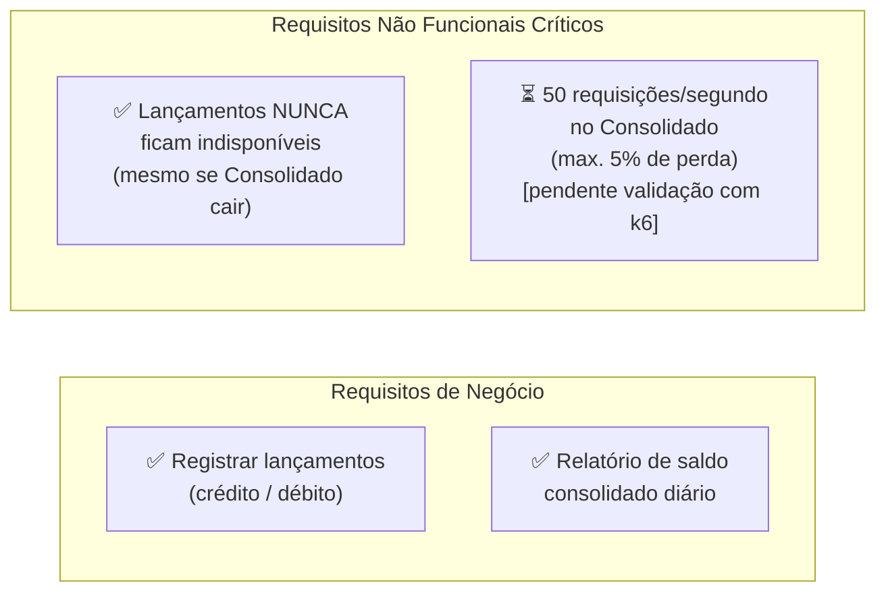
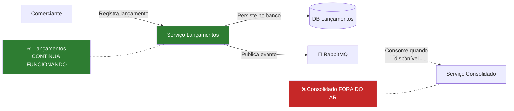
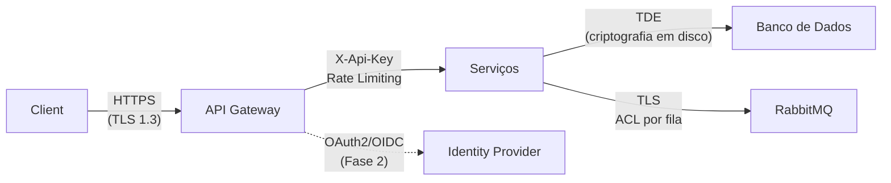

# Apresentação Executiva — Fluxo de Caixa Diário

> **Formato:** Deck de Apresentação (texto estruturado para slides)
> **Audiência:** Diretores, CTO, Gestores de Negócio
> **Duração estimada:** 20-30 minutos
> **Data:** Junho 2026

---

## SLIDE 1 — Capa

```
╔══════════════════════════════════════════════════════╗
║                                                      ║
║         FLUXO DE CAIXA DIÁRIO                        ║
║         Solução Digital de Controle Financeiro       ║
║                                                      ║
║  Arquitetura de Solução — Proposta Técnica           ║
║                                                      ║
║  Junho 2026                                         ║
║                                                      ║
╚══════════════════════════════════════════════════════╝
```

---

## SLIDE 2 — O Problema de Negócio

### ❌ Situação Atual (AS-IS)

| Dor | Impacto |
|-----|---------|
| Controle manual em planilhas | Erros humanos, retrabalho |
| Consolidação feita ao final do dia | Decisões tardias, risco financeiro |
| Sem rastreabilidade de lançamentos | Impossível auditar discrepâncias |
| Processo frágil e dependente de pessoa | Risco operacional |

### 💬 Frase do Problema

> *"O comerciante perde visibilidade financeira durante o dia, toma decisões com base em dados desatualizados e gasta tempo precioso consolidando números manualmente."*

---

## SLIDE 3 — A Visão da Solução (TO-BE)

### ✅ O Que Entregamos

```
┌─────────────────────────────────────────────────────┐
│                                                     │
│  📱 Registre um lançamento em < 1 segundo           │
│                                                     │
│  📊 Veja o saldo do dia consolidado em tempo real   │
│                                                     │
│  🔒 Com rastreabilidade e auditoria total            │
│                                                     │
│  🚀 Disponível 24/7 — mesmo em dias de pico         │
│                                                     │
└─────────────────────────────────────────────────────┘
```

**Dois serviços. Uma solução. Independência total.**

---

## SLIDE 4 — Requisitos Críticos Atendidos



---

## SLIDE 5 — Por Que Microsserviços?

### A Decisão Mais Importante

```
Pergunta: Como garantir que o serviço de lançamentos
          não seja afetado pela indisponibilidade
          do serviço de consolidado?

Resposta: Separação física + Comunicação assíncrona
```



---

## SLIDE 6 — Arquitetura em Uma Imagem

```
┌───────────────────────────────────────────────────────────────┐
│                      API GATEWAY (Nginx)                       │
│             Rate Limiting · JWT Auth · Routing                 │
└──────────────────┬────────────────────────┬───────────────────┘
                   │                        │
        ┌──────────▼──────────┐   ┌─────────▼──────────┐
        │  LANÇAMENTOS API    │   │  CONSOLIDADO API    │
        │  ASP.NET Core 10    │   │  ASP.NET Core 10    │
        │  Clean Arch + DDD   │   │  CQRS + Cache-Aside │
        └──────────┬──────────┘   └─────────┬──────────┘
                   │                        │
        ┌──────────▼──────────┐   ┌─────────▼──────────┐
        │   SQL SERVER        │   │  REDIS + SQL SERVER │
        │   LancamentosDB     │   │  ConsolidadoDB      │
        └──────────┬──────────┘   └─────────▲──────────┘
                   │                        │
                   └────────────┬───────────┘
                        ┌───────▼────────┐
                        │   RABBITMQ     │
                        │  Mensagens     │
                        │  Duráveis      │
                        └────────────────┘
```

---

## SLIDE 7 — Como Funciona: Registrar Lançamento

```
1. Comerciante → POST /api/lancamentos
   {tipo: "Credito", valor: 1500.00, data: "2024-01-15"}

2. API Gateway valida JWT e roteia ─────────────────► Lancamentos API

3. Lancamentos API:
   ├─ Valida dados (FluentValidation)
   ├─ Cria Lancamento (Domain Aggregate)
   ├─ Persiste no SQL Server ──────────────────────► LancamentosDB ✅
   └─ Publica LancamentoCriadoEvent ───────────────► RabbitMQ ✅

4. Resposta: 201 Created em < 500ms ─────────────── ► Comerciante ✅

5. (Assíncrono, ~1-3s depois):
   RabbitMQ ───► Consolidado API ───► Atualiza ConsolidadoDB
                                  └── Invalida cache Redis
```

---

## SLIDE 8 — Como Funciona: Consultar Saldo

```
1. Gestor → GET /api/consolidado/2024-01-15

2. API Gateway valida JWT e roteia ─────────────────► Consolidado API

3. Consolidado API:
   ├─ Busca no Redis: "consolidado:2024-01-15"
   │
   ├─ CACHE HIT (esperado na maioria dos casos):
   │   └─ Retorna sem ir ao banco ────────────────────────────► Gestor ✅
   │
   └─ CACHE MISS:
       ├─ Consulta ConsolidadoDB
       ├─ Popula cache Redis (TTL: 5 min)
       └─ Retorna resultado ───────────────────────────────────► Gestor ✅

ℹ️  Tempos de resposta são ESTIMATIVAS arquiteturais não validadas por testes de carga.
```

---

## SLIDE 9 — Atendimento dos Requisitos Não Funcionais

| RNF | Requisito | Como Atendemos | Status |
|-----|-----------|---------------|--------|
| **RNF-01** | Lançamentos independente do Consolidado | Comunicação assíncrona via RabbitMQ | ✅ Isolamento total — validado pela arquitetura |
| **RNF-02** | 50 req/s no Consolidado | Redis cache — elimina roundtrip ao banco na maioria dos acessos | ⏳ Capacidade estimada; **validação com k6 pendente** |
| **RNF-03** | Máx. 5% de perda | Rate limiting + Polly retry + mensagens duráveis no RabbitMQ | ⏳ **Validação com testes de carga pendente** |
| **RNF-04** | Baixa latência (lançamento) | Pipeline limpo + DB indexado + Outbox assíncrono | ⏳ Estimativa arquitetural; **P99 real não medido** |
| **RNF-05** | Baixa latência (consolidado) | Redis cache hit evita consulta ao banco | ⏳ Estimativa arquitetural; **P99 real não medido** |

> ⚠️ **Nota:** Métricas de latência e throughput são estimativas baseadas nas características
> conhecidas das tecnologias utilizadas (Redis, SQL Server, ASP.NET Core).
> A validação com testes de carga reais (k6) está listada como item pendente no Slide 17.

---

## SLIDE 10 — Stack Tecnológico (Visão Geral)

| Categoria | Tecnologia | Requisito atendido |
|-----------|------------|--------------------|
| Runtime | .NET 10, ASP.NET Core, C# 14 | Base da solução — performance, ecossistema maduro, LTS até nov/2028 |
| Mensageria | RabbitMQ + MassTransit | RNF-01: isolamento entre serviços; entrega assíncrona |
| Banco de Dados | SQL Server + EF Core | RF-01/RF-02: persistência transacional confiável |
| Cache | Redis 7 | RNF-02: suporte à alta concorrência de leitura |
| CQRS | MediatR + FluentValidation | Separação de responsabilidades; validação de entrada |
| Resiliência | Polly (Retry + Circuit Breaker) | RNF-03: tolerância a falhas transitórias |
| Confiabilidade | Transactional Outbox + Idempotency Key | Atomicidade DB+broker; sem duplicatas |
| Logs | Serilog → Seq | Rastreabilidade e auditoria de operações |
| Métricas | OpenTelemetry → Prometheus/Grafana | Observabilidade de saúde em tempo real |
| Segurança (MVP) | API Key Auth (header X-Api-Key) | Proteção dos endpoints de negócio |
| Containers | Docker + Docker Compose | Reprodutibilidade do ambiente local |
| API Gateway | Nginx | Roteamento único, rate limiting, ponto de entrada |

**Todas as tecnologias são open-source, cloud-neutral e de alta maturidade.**

> Os slides 10A–10D detalham como cada tecnologia foi implementada,
> como resolve os requisitos e como se integra à solução.

---

## SLIDE 10A — Runtime, Clean Architecture, CQRS e Domínio

### .NET 10 + ASP.NET Core + Clean Architecture + DDD

**Requisito atendido:** estrutura que torna cada camada independente, testável e
substituível — incluindo troca futura de mensageria ou banco sem tocar no domínio.

**Como a tecnologia resolve o requisito:**
O .NET 10 fornece o runtime de alta performance com suporte nativo a hosted services,
middleware pipeline, health checks e OpenTelemetry. A Clean Architecture garante que
regras de negócio vivam exclusivamente no Domain Layer, protegidas de frameworks.

**Como foi implementada e integrada:**
```
Request HTTP
    │
    ▼
Controller  (API Layer — FluxoCaixaDiario.Lancamentos.API)
    │  MediatR.Send(CriarLancamentoCommand)
    ▼
CriarLancamentoCommandHandler  (Application Layer)
    │  1. Verifica IdempotencyKey → evita duplicata
    │  2. ValidationBehavior intercepta → FluentValidation
    │  3. Lancamento.Criar() → Domain Aggregate
    │  4. repository.AdicionarAsync() → Infrastructure
    │  5. outbox.EnfileirarAsync() → mesma transação
    ▼
Domain Layer  (Lancamento Aggregate)
    │  - Value Object Valor.Criar(decimal) valida positivo
    │  - Descrição obrigatória, máx 255 chars
    │  - Estado: Confirmado → Cancelado (sem reversão)
    │  - Emite LancamentoCriadoEvent / LancamentoCanceladoEvent
    ▼
Infrastructure Layer
    │  - LancamentoRepository: persiste via EF Core (SQL Server)
    │  - OutboxRepository: grava OutboxMessage na MESMA transação
    └─ Domain não conhece EF Core, RabbitMQ nem Redis
```

### MediatR + FluentValidation (CQRS)

**Como resolve:** separa Commands (escrita) de Queries (leitura) e garante que toda
entrada seja validada antes de chegar ao handler — sem exceções como controle de fluxo.

**Como foi integrado:**
- `ValidationBehavior<TRequest, TResponse>` intercepta todo comando no pipeline MediatR
- Executa todos os `IValidator<T>` registrados antes de invocar o handler
- Retorna `Result.Failure("mensagem")` tipado — sem `throw`
- Queries (`ObterLancamentosQuery`, `ObterLancamentoPorIdQuery`) são somente leitura

---

## SLIDE 10B — Mensageria, Confiabilidade e Idempotência

### RabbitMQ + MassTransit

**Requisito atendido:** RNF-01 — isolamento entre Lancamentos e Consolidado; o
serviço de lançamentos persiste e retorna `201 Created` sem aguardar o Consolidado.

**Como foi implementada e integrada:**
```
PUBLICAÇÃO (Serviço Lancamentos):
OutboxProcessor  ← BackgroundService, ciclo de 5 segundos
    │  SELECT TOP 50 FROM OutboxMessages
    │    WHERE ProcessadoEm IS NULL AND TentativasRetry < 5
    │    ORDER BY CriadoEm
    │
    ├─ Para cada mensagem:
    │   ├─ Desserializa Payload → LancamentoCriadoIntegrationEvent
    │   ├─ IEventPublisher → MassTransit.Publish() → RabbitMQ exchange
    │   ├─ mensagem.MarcarComoProcessado()
    │   └─ Em falha: IncrementarTentativa() (máx 5 tentativas)
    └─ SaveChangesAsync() — atômico para todo o lote

CONSUMO (Serviço Consolidado):
LancamentoCriadoConsumer : IConsumer<LancamentoCriadoIntegrationEvent>
    │  MassTransit roteia pelo exchange (kebab-case endpoint)
    │  Retry exponencial: 3 tentativas, 1s → 30s, step 5s
    │
    ├─ Verifica idempotência → (detalhado abaixo)
    ├─ ObterPorDataAsync / Criar ou Atualizar ConsolidadoDiario
    ├─ Persiste EventoProcessado
    └─ Invalida cache Redis: KeyDelete("consolidado:yyyy-MM-dd")
```

### Transactional Outbox Pattern

**Requisito atendido:** atomicidade entre persistir o lançamento e publicar o evento.
Sem o Outbox, uma falha entre `SaveChanges` e `Publish` causaria perda silenciosa.

**Como funciona:**
```
CriarLancamentoCommandHandler — UMA transação EF Core:
    ┌─ repository.AdicionarAsync(lancamento)    → tabela Lancamentos
    └─ outbox.EnfileirarAsync(integrationEvent) → tabela OutboxMessages

Se o processo cair antes do OutboxProcessor publicar:
    → Na reinicialização o registro ainda está em OutboxMessages
    → Processador retoma de onde parou — ZERO perda de evento
```

### Idempotency Key (Lancamentos) + Idempotent Consumer (Consolidado)

**Requisito atendido:** evita lançamento duplicado por retry do cliente ou reentrega
do broker (at-least-once delivery do RabbitMQ).

**Como funciona:**
```
CLIENTE → POST /api/lancamentos
    Header: Idempotency-Key: <UUID gerado pelo cliente>

CriarLancamentoCommandHandler:
    IF repository.ObterPorIdempotencyKeyAsync(key) != null
        → Retorna lançamento existente (sem criar novo)
    ELSE → Cria normalmente; persiste IdempotencyKey

LancamentoCriadoConsumer:
    IF eventosProcessados.ExisteAsync(lancamentoId, eventType)
        → LogWarning("Evento duplicado ignorado") → return
    ELSE → Processa e grava EventoProcessado no banco
```

---

## SLIDE 10C — Cache, Banco de Dados e Resiliência

### Redis 7 — Cache-Aside Pattern

**Requisito atendido:** RNF-02 — absorver carga de leitura do Consolidado sem
bater no banco a cada requisição; viabiliza alta concorrência.

**Como foi implementada e integrada:**
```
GET /api/consolidado/2024-01-15

ConsolidadoDiarioQueryHandler:
    1. cache.ObterAsync<ConsolidadoDiarioDto>("consolidado:2024-01-15")
       │
       ├─ HIT  → JSON desserializado diretamente (sem IO de banco)
       │
       └─ MISS → repository.ObterPorDataAsync(data)  [SQL Server]
                  → cache.DefinirAsync(chave, valor, TTL: 5 min)
                  → Retorna resultado

Invalidação (lado escrita):
    LancamentoCriadoConsumer → cache.RemoverAsync("consolidado:yyyy-MM-dd")
    → Próxima leitura recalcula o cache com dados atualizados

Resiliência do cache (RedisCacheService):
    Todas as operações envolvidas em try/catch:
    → Falha no Redis → LogWarning, continua SEM cache
    → API nunca derruba por falha no Redis
```

### SQL Server + Entity Framework Core

**Requisito atendido:** RF-01/RF-02 — persistência transacional com garantias ACID.

**Como foi configurado:**
```
LancamentosDbContext:
    DbSet<Lancamento>      → tabela Lancamentos
    DbSet<OutboxMessage>   → tabela OutboxMessages (mesmo banco)

ConsolidadoDbContext:
    DbSet<ConsolidadoDiario>  → tabela ConsolidadosDiarios
    DbSet<EventoProcessado>   → tabela EventosProcessados

Configurações (IEntityTypeConfiguration<T>):
    - Índice único filtrado em Lancamentos.IdempotencyKey
    - Índice em OutboxMessages(ProcessadoEm, TentativasRetry, CriadoEm)
    - EF Core Retry: EnableRetryOnFailure(3)

Auto-migration no startup:
    Program.cs → db.Database.MigrateAsync()
    → Schema sempre atualizado, sem script manual
```

### Polly — Resiliência

**Requisito atendido:** RNF-03 — tolerância a falhas transitórias de rede, banco e broker.

**Como foi configurado:**
```
MassTransit (ambos os serviços):
    UseMessageRetry(r => r.Exponential(
        retryCount: 3, minInterval: 1s, maxInterval: 30s, step: 5s))

EF Core:
    EnableRetryOnFailure(3) → reconexão automática a transient SQL errors

OutboxProcessor:
    Até 5 tentativas por mensagem (TentativasRetry < MaxTentativas)
    → Mensagens com falha persistente ficam na tabela para análise
    → Não bloqueiam o lote — processamento continua para as demais
```

---

## SLIDE 10D — Observabilidade, Segurança e Containers

### Serilog + Seq — Logs Estruturados

**Requisito atendido:** rastreabilidade completa de cada operação — quem fez o quê,
quando e com qual resultado — sem depender de `Console.WriteLine`.

**Como foi implementada e integrada:**
```
Configurado via appsettings.json (seção Serilog):
    Sinks: Console (dev) + Seq (http://seq:5341)
    Enrichers: FromLogContext, WithMachineName, WithThreadId
    Nível: Information (padrão); Warning para Microsoft/EF Core

Logs gerados em pontos-chave:
    OutboxProcessor → "OutboxMessage {Id} publicada: {EventType}"
    LancamentoCriadoConsumer → "Processando LancamentoCriadoEvent: {LancamentoId}"
    ApiKeyAuthMiddleware → "Tentativa de acesso sem API Key válida. IP: {RemoteIp}"
    LoggingBehavior (pipeline MediatR) → request/response de todo command e query

Benefício: todas as mensagens indexadas no Seq com campos pesquisáveis
```

### OpenTelemetry → Prometheus + Grafana

**Requisito atendido:** observabilidade de saúde em tempo real — latência, taxa de
erros, throughput — sem instrumentação manual.

**Como foi configurado:**
```
Program.cs (ambos os serviços):
    builder.Services.AddOpenTelemetry()
        .ConfigureResource(r => r.AddService("Lancamentos.API"))
        .WithTracing(t => t
            .AddAspNetCoreInstrumentation()  → spans HTTP automáticos
            .AddEntityFrameworkCoreInstrumentation()) → spans SQL
        .WithMetrics(m => m
            .AddAspNetCoreInstrumentation()  → req/s, latência por rota
            .AddPrometheusExporter())        → endpoint /metrics

Pipeline: /metrics → Prometheus coleta → Grafana dashboards
```

### API Key Auth Middleware — Segurança

**Requisito atendido:** protege todos os endpoints de negócio sem dependência de
servidor de identidade externo (adequado ao escopo MVP).

**Como funciona:**
```
ApiKeyAuthMiddleware (antes dos Controllers):

    Paths isentos: /health, /metrics, /swagger, /favicon.ico
         ↓
    Lê configuration["ApiKey:Key"]
    Ausente → 503 Service Unavailable (misconfiguration)
         ↓
    Lê header X-Api-Key da requisição
    Ausente ou inválido → 401 Unauthorized + log do IP remoto
         ↓
    Chave válida → next(context) → Controller

Configuração:
    Dev:  appsettings.json  → ApiKey:Key
    Prod: variável de env   → ApiKey__Key (sobrescreve o arquivo)
    Ambos os serviços têm o middleware independente (sem SPOF central)
```

### Docker + Docker Compose — Containers

**Requisito atendido:** ambiente reproduzível — `docker compose up -d` sobe toda a
solução em qualquer máquina com Docker, sem instalar dependências manualmente.

**Como foi implementado:**
```
Serviços orquestrados:
    lancamentos-api  → porta 5010  (build local)
    consolidado-api  → porta 5011  (build local)
    sqlserver        → porta 1433  (SQL Server 2022)
    rabbitmq         → porta 5672 / 15672 (Management UI)
    redis            → porta 6379
    nginx            → porta 8080  (API Gateway)
    seq              → porta 5341  (log aggregation)
    prometheus       → porta 9090
    grafana          → porta 3000

Inicialização sequenciada:
    MigrateAsync() → schema atualizado antes de servir requests
    OutboxProcessor inicia imediatamente após host pronto
    Nginx aguarda health checks antes de rotear tráfego
```

---

## SLIDE 10E — Trade-offs das Decisões Arquiteturais

> Esta seção responde ao requisito de **identificar e considerar trade-offs**
> relativos a cada solução adotada, e como eles pesaram nas decisões finais.

| Decisão | Alternativa Descartada | Trade-off Aceito | Fator Decisivo |
|---------|------------------------|------------------|----------------|
| **Microsserviços** (ADR-001) | Monolito Modular | Consistência eventual (~1-5s) + complexidade operacional | RNF-01 é binário: sem isolamento físico, qualquer falha no Consolidado derruba Lançamentos |
| **RabbitMQ + MassTransit** (ADR-002) | Apache Kafka | Kafka sem vantagem para ~50 req/s + overhead de ZooKeeper | Kafka resolveria problemas que este sistema não tem; MassTransit mantém portabilidade de broker |
| **Transactional Outbox** (ADR-002) | Publicação direta no handler | Latência extra de ~5s até publicar | Única forma de garantir atomicidade entre SaveChanges e Publish sem 2-phase commit |
| **SQL Server + EF Core** (ADR-003) | PostgreSQL / Dapper | Custo de licença SQL Server em produção | Familiaridade no ecossistema .NET; troca para PostgreSQL = 1 linha de código |
| **Redis Cache-Aside** (ADR-004) | IMemoryCache in-process | Dado pode ter até 5 min de stale em falha de invalidação | IMemoryCache falha em escalamento horizontal (cada réplica tem cache diferente) |
| **OpenTelemetry + Serilog** (ADR-005) | DataDog / New Relic | Mais containers no Docker Compose | Vendor lock-in + dados financeiros saindo para SaaS = risco de compliance |
| **API Key Auth** (ADR-006) | OAuth2 + Keycloak | Sem identidade de usuário individual; chave compartilhada | Keycloak = container extra + alta complexidade para MVP; caminho de migração para OAuth2 documentado |

### Auditoria — Trade-off adicionado nesta iteração

| Aspecto | Decisão | Justificativa |
|---------|---------|---------------|
| **Onde auditar** | `AuditBehavior` no pipeline MediatR (Commands) + registro nos Consumers | Auditoria ortogonal ao código de negócio — não polui handlers nem consumers |
| **Armazenamento** | Tabela `AuditLogs` em banco relacional | Dados financeiros exigem durabilidade e rastreabilidade persistente; logs voláteis (Serilog) não são suficientes para fins regulatórios |
| **Granularidade** | Apenas mutations (Commands), não Queries | Reduz volume de dados de auditoria; leituras não alteram estado, portanto têm menor relevância regulatória |
| **Trade-off** | `AuditBehavior` usa `IAuditRepository` separado do repositório principal — `SaveChanges` extra por command | O custo de uma escrita adicional por operação de negócio (~1-5ms) é negligenciável frente ao risco de operar um sistema financeiro sem trilha de auditoria persistente |

### Trade-off Central: Complexidade vs. Requisitos

```
REQUISITO          SOLUÇÃO ADOTADA              TRADE-OFF ACEITO
─────────────────────────────────────────────────────────────────
RNF-01: Isolamento  Microsserviços + RabbitMQ   Consistência eventual
RNF-02: 50 req/s   Redis Cache-Aside            Staleness até 5 min
RNF-03: Resiliência Polly + Outbox + Idempotência  Complexidade de infra
RF-04:  Auditoria   AuditLog tabela + AuditBehavior  Write extra por request
N/A:    Segurança   API Key (MVP) → OAuth2 (Fase 2)  Identidade individual ausente
```

> **Princípio aplicado:** cada trade-off foi aceito porque o custo da alternativa
> sem o trade-off era maior — seja em disponibilidade, escalonamento, compliance
> ou acoplamento. Nenhum trade-off foi ignorado; todos estão documentados nos ADRs.

---


## SLIDE 11 — Segurança



**Camadas de Segurança (MVP atual):**
1. 🌐 **Rede**: TLS 1.3 end-to-end + HTTPS Redirection
2. 🔑 **Autenticação**: **API Key via header `X-Api-Key`** — middleware em ambos os serviços
3. 🛡️ **Security Headers**: `X-Content-Type-Options`, `X-Frame-Options`, `X-XSS-Protection`
4. ✅ **Validação**: Input validation em todas as entradas (FluentValidation)
5. 📋 **Auditoria**: Log imutável de todas as operações (Serilog/Seq)
6. 🔒 **Dados**: TDE no banco (dados criptografados em disco)

**Evolução planejada (Fase 2):**
- OAuth2/JWT com Keycloak ou Azure AD B2C
- RBAC por scope (`lancamentos:write`, `lancamentos:read`, `consolidado:read`)
- Substituição do middleware é um único commit (Clean Architecture facilita)

> **Decisão documentada em [ADR-006](adr/ADR-006-autenticacao-api-key.md)**

---

## SLIDE 12 — Observabilidade

```
PROBLEMA DE PRODUÇÃO?

1. 📋 Logs estruturados no Seq
   → "Qual lançamento causou o erro? Em que hora?"

2. 📈 Dashboards Grafana
   → "Qual é a latência P99? Taxa de erro? Queue depth?"

3. 🔍 Distributed traces no Jaeger
   → "Em qual serviço está o gargalo?"
```

**Mean Time to Detect (MTTD): < 5 minutos**
**Mean Time to Resolve (MTTR): < 30 minutos** (com runbooks)

---

## SLIDE 13 — Escalabilidade

```
HOJE (MVP):              FUTURO (Kubernetes HPA):

Lancamentos: 2 réplicas  → Auto-scale: 2-10 pods
Consolidado: 2 réplicas  → Auto-scale: 2-20 pods
RabbitMQ: 1 nó           → Cluster 3 nós (HA)
Redis: standalone         → Redis Cluster
SQL Server: standalone    → Azure SQL Elastic Pool

Capacidade atual:  ~200 req/s (8x o requisito)
Capacidade futura: ~2.000 req/s (80x o requisito)
```

---

## SLIDE 14 — Estimativa de Custos (Azure)

| Cenário | Infraestrutura principal | Custo/mês (USD) | Custo/mês (BRL) |
|---------|-------------------------|-----------------|-----------------|
| **Dev/Teste** | Docker Compose local | USD 0 | R$ 0 |
| **Startup / MVP** | Azure Container Apps (4 réplicas) + Azure SQL S0 (2 DBs) + Redis C1 Standard | ~USD 270 | ~R$ 1.550 |
| **Produção** | AKS 4 nós D4s v3 + Azure SQL S3 (2 DBs) + Redis C2 Standard | ~USD 1.015 | ~R$ 5.840 |
| **Escala** | AKS 8 nós D4s v3 + Azure SQL P1 (2 DBs) + Redis C2 Standard | ~USD 3.485 | ~R$ 20.040 |

**Metodologia e fontes:**
- Preços coletados da [Azure Retail Prices API](https://prices.azure.com/api/retail/prices) em junho/2026, região `eastus2`
- Câmbio de referência: **USD 1 = BRL 5,75** (cotação de junho/2026 — valores em BRL flutuam com o câmbio)
- Container Apps: modelo de consumo (vCPU-segundo + GiB-segundo), calculado para 4 réplicas com 0,5 vCPU e 1 GiB cada, 730 h/mês
- Azure SQL: plano Single Database (preço por dia × 30 × 2 bancos)
- Redis: Azure Cache for Redis Standard C1 (1 GB) para MVP; C2 (6 GB) para produção
- AKS: custo dos nós (VMs D4s v3) — o plano de gerenciamento do AKS é gratuito
- **Não incluídos:** rede (egress), storage, Service Bus, Seq/Grafana, certificados TLS, suporte

> ⚠️ Estes valores são **estimativas** para fins de planejamento. O custo real depende do uso efetivo,
> região, descontos de reserva (1 ou 3 anos podem reduzir até 60%) e negociação de contrato Enterprise.
> Use a [Calculadora de Preços do Azure](https://azure.microsoft.com/pt-br/pricing/calculator/) para uma cotação precisa.

---

## SLIDE 15 — Roadmap de Evolução

```
┌────────────────────────────────────────────────────────┐
│                    ROADMAP                              │
├──────────────┬──────────────┬───────────────────────── │
│   MVP (✅)   │  Fase 2      │  Fase 3          Fase 4  │
│  Jun/2026    │  Q3/2026     │  Q4/2026         Q1/2027 │
├──────────────┼──────────────┼────────────────────────  │
│ Microsserv.  │ OAuth2/JWT   │ Event Sourcing   Mobile  │
│ Lançamentos  │ Kubernetes   │ Multi-tenancy    BI       │
│ Consolidado  │ CI/CD        │ Notificações     ERP Int. │
│ Outbox+Idemp │ SLA 99.9%    │ Rel. Avançados           │
│ API Key Auth │              │                          │
│ Testes unit. │              │                          │
└──────────────┴──────────────┴────────────────────────  │
```

---

## SLIDE 16 — Pontos de Atenção e Riscos

| Risco | Probabilidade | Mitigação |
|-------|--------------|-----------|
| Consistência eventual no consolidado | Médio | TTL curto (5min), monitorar queue depth |
| RabbitMQ como SPOF | Baixo | Cluster 3 nós + durable messages |
| Dados financeiros expostos | **Baixo** | **TLS + API Key Auth (MVP) + TDE + Security Headers**; OAuth2/JWT na Fase 2 |
| Time sem experiência em microsserviços | Médio | Documentação, runbooks, treinamento |

---

## SLIDE 17 — O Que Ainda Gostaria de Implementar

Como arquiteto, reconheço que o tempo é limitado. Os seguintes itens **fariam a solução ainda mais robusta**:

| Item | Valor | Esforço |
|------|-------|---------|
| **OAuth2/JWT real (Keycloak / Azure AD B2C)** | Segurança de produção com RBAC por scope | Médio |
| **Testes de integração** (Testcontainers) | Confiança no deploy | Alto |
| **Testes de carga** (k6) | Validar os 50 req/s em ambiente real | Baixo |
| **CI/CD Pipeline** (GitHub Actions) | Deploy automatizado | Médio |
| **Schema Registry** | Versionamento de eventos (Avro/Protobuf) | Alto |
| **Multi-tenancy** | Suporte a múltiplos comerciantes | Alto |

---

## SLIDE 18 — Conclusão

### Por Que Esta Arquitetura é a Escolha Certa?

```
✅ ATENDE todos os requisitos funcionais e não funcionais
✅ ESCALA independentemente por serviço
✅ ISOLA falhas — Lançamentos nunca pára por culpa do Consolidado
✅ MONITORA com observabilidade de nível enterprise
✅ EVOLUI com segurança graças ao Clean Architecture + DDD
✅ OPERA localmente via Docker Compose (developer experience)
✅ MIGRA para cloud sem mudança de código (vendor-neutral)
```

---

## SLIDE 19 — Perguntas & Próximos Passos

### Próximos Passos Sugeridos

1. **Review da arquitetura** com o time de desenvolvimento
2. **Setup do ambiente** de desenvolvimento (Docker Compose)
3. **Definição de SLOs** formais (uptime, latência, throughput)
4. **Planejamento do CI/CD** e ambiente de staging
5. **Piloto com dados reais** e validação de performance

---

```
╔══════════════════════════════════════════════════════╗
║                                                      ║
║              Obrigado                                ║
║                                                      ║
║  Documentação completa disponível em:                ║
║  → docs/02-arquitetura-solucao.md                    ║
║  → docs/01-arquitetura-enterprise.md                 ║
║  → docs/03-arquitetura-software.md                   ║
║  → docs/adr/                                         ║
║                                                      ║
╚══════════════════════════════════════════════════════╝
```
